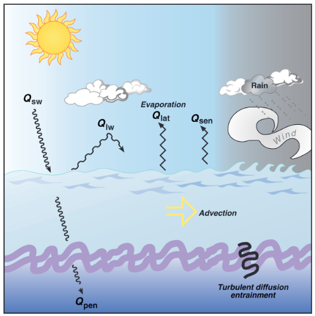

<h1> Air-Sea Interactions Theory </h1>

Air-sea interaction refers to the exchange of energy, momentum, and mass between the atmosphere and the ocean.

**Why should we care about air-sea interactions?**

They play a central role in weather, climate regulation, and ocean circulation. Air-sea exchanges are vital for the prediction weather to the climate system, especially with links to floods, droughts, storm intensity, and storm tracks. Therefore, the protection of people, property, and environmental resources from extreme weather, seasonal patterns, and climate change drives the need for predictions of weather, ocean, and climate patterns that have skill and value at timescales longer than traditional 1-10-day forecasts, including outlooks spanning weeks to decades. To do this, we need a solid grasp on the processes associated with air-sea exchange and what drives their variability.

  
  
<em>Air-sea interactions schematic. Source: <a href="WHOI">https://www2.whoi.edu/site/casimas/</a></em>

<h2> Key Components Involved </h2>

- **Atmosphere:** The lower part (troposphere) is most relevant for interactions. The part of direct relevance for air-sea interactions is the marine atmospheric boundary layer, often abbreviated to MABL.
- **Ocean Surface Layer:** The uppermost layer (~10–100 m), also known as the mixed layer or ocean boundary layer, is directly influenced by atmospheric forcing across the air-sea interface.

  
  
<em>Structure and processes in the marine boundary layers. MABL, marine atmospheric boundary layer; OBL, oceanic boundary layer. Source: <a href="Boundary Layer Dynamics (1997)">https://nap.nationalacademies.org/read/5710/chapter/3</a></em>

<h2> Energy Exchange Processes </h2>

<h3> Radiative fluxes: </h3>

- **Solar Radiation (Shortwave):** Most energy input comes from the sun; absorbed by the ocean surface. 
- **Longwave Radiation:** Ocean emits longwave radiation (IR) back to the atmosphere.

<h3> Turbulent fluxes: </h3>

- **Latent Heat Flux:** Energy loss due to evaporation; carries moisture to the atmosphere.
- **Sensible Heat Flux:** Direct heat exchange between ocean and air due to temperature difference.

**Net Heat Flux** = (Incoming Solar) - (Outgoing Longwave + Latent + Sensible)

  
  
<em>Wind and buoyancy acts on the ocean surface boundary later. Solar radiation (\\(Q_{sw}\\)), net longwave radiation (\\(Q_{lw}\\)), latent heat flux (\\(Q_{lat}\\)), and sensible heat flux (\\(Q_{sen}\\)) combine to form the net surface heat flux (\\( Q_{net}\\)). \\(Q_{pen}\\) is the solar radiation penetrating the base of the mixed layer. Source: <a href="/references/#CS01">[CS01]</a></em>

<h3> Momentum exchange: </h3>

Wind Stress: The frictional force of wind blowing across the sea surface transfers momentum to the ocean, driving surface currents and waves.

Quantified as:
        
\\[ \tau = \rho_a C_D U^2 \\]

where \\( \tau \\) is wind stress, \\( \rho_a \\) is air density, \\( C_D \\)​ is drag coefficient, and \\( U \\) is wind speed taken from a reference height of 10 meters above the sea surface.

<h3> Mass exchange: </h3>

- **Evaporation:** Transfers water from the ocean to the atmosphere.
- **Precipitation:** Returns water from the atmosphere to the ocean.
- **Gas Exchange:** Exchange of gases like O₂, CO₂ based on concentration gradients.