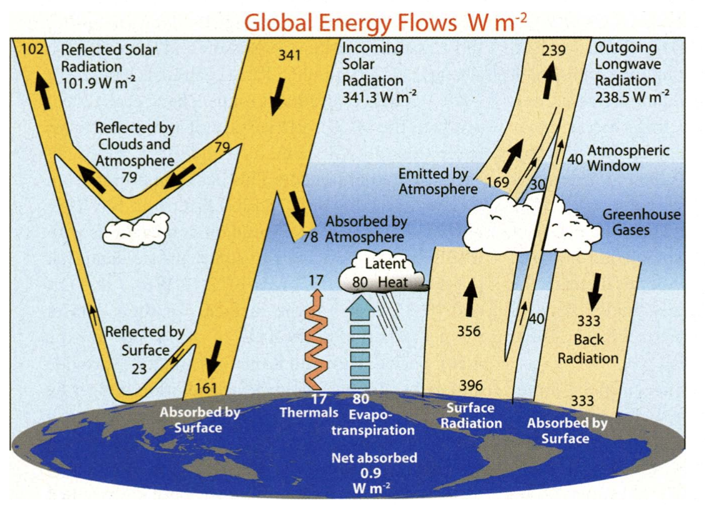

# Global energy distribution and air-sea interactions

*“Ocean motions result from the overall forcing of the climate system but are filtered through various processes on different scales before arriving at the motions of interest for a particular application.”* -- BFK18

I quite like this quote because when we talk about scales of interest it really depends on your application. Each has their relative importance and necessity to understand and be curious about.

## Global energy budget

The Earth's atmosphere receives its heat through solar radiation, which acts primarily in the wavelength range of 0.25-4 micrometres (µm). Meanwhile, outgoing longwave radiation falls within the infrared portion of the spectrum and has typical wavelengths of 4 to 30 µm.

  
  
<em>Radiation spectrum. Source: <a href="https://science.nasa.gov/ems/">https://science.nasa.gov/ems/</a></em>

Globally, over the year, the Earth system - land surfaces, oceans, and atmosphere - absorbs an average of about 239 watts of solar power per square meter (1 watt = 1 J/s).

Joule is a unit of energy that measures the energy required to create heat.

**What are some consequences of this energy uptake on Earth?**

Fusion keeps the solar system warm, so presently the vast majority of the heating of the Earth and, thus, the motions of the atmosphere and oceans comes from the Sun’s energy. At the top of the atmosphere (~100 km above the earth’s surface), 341 W m$^{-2}$ of solar power arrives as primarily shortwave radiation. 102 W m$^{-2}$ of this shortwave radiation is reflected back to space, with about 239 W m$^{-2}$ entering the earth’s atmosphere.

  
  
<em>Global annual mean Earth's energy budget between 2000--2004. Arrows are scaled to their relative importance. Source: [TFK09]em>

The Earth's energy budget involves the balance between incoming solar radiation and outgoing terrestrial radiation. This balance is crucial for maintaining the climate system.

### Components of the Energy Budget
Incoming Solar Radiation (Solar In) represents the solar energy that enters the Earth's atmosphere of approximately 341.3 W m$^{-2}$. Part of the incoming solar radiation is reflected back to space by clouds, aerosols, and the Earth's surface, which accounts for roughly just under a third (101.9 W m$^{-2}$). The remaining solar radiation is absorbed by the atmosphere and the Earth's surface, approximately 238.5 W m$^{-2}$.

The Earth emits longwave radiation back to space, balancing the absorbed solar radiation of about 238.5 W m$^{-2}$. The Stefan–Boltzmann law describes the power radiated from a black body in terms of its temperature.

**The Stefan-Boltzmann law**\
$$j^* = \sigma T^4$$

$$j^*$$ is the black-body radiant emittance, $$\sigma$$ has a value of 5.670374419 $$\times$$ 10$^{−8}$ W (m$^{2}$ x K$^4$), which represents the constant of proportionality between these two variables.

### Summary of the Energy Flow Processes

- **Atmospheric Absorption**: Solar radiation absorbed by atmospheric components like water vapor, clouds, and aerosols.
- **Surface Absorption**: Solar radiation absorbed by the Earth's surface, contributing to heating the land and oceans.
- **Surface Emission**: The Earth's surface emits longwave radiation, which is partly absorbed by the atmosphere and partly escapes to space.
- **Back Radiation**: Longwave radiation emitted by the atmosphere back to the Earth's surface, contributing to the greenhouse effect.

The energy in the Earth system is transported around in the following ways:

- **Latent Heat Flux**: Energy transported through the evaporation and condensation of water.
- **Sensible Heat Flux**: Direct heat transfer from the Earth's surface to the atmosphere.
- **Ocean Heat Transport**: Movement of heat within the ocean, affecting global climate patterns.

The figure shows a slight imbalance at the top of the atmosphere (TOA), indicating ongoing changes in the climate system. This reflects the significant role of clouds and aerosols in reflecting and absorbing solar radiation, impacting the energy budget. Improvements in satellite data and reanalysis methods have refined estimates of the energy budget components. There are sure to be updates.

## General readings for this section

- BFK18
- TFK09

## Learning Goals

After working through this section, learners should be able to:

- Understand the Earth's energy budget
- Have a basic understanding of the Earth's energy imbalance
