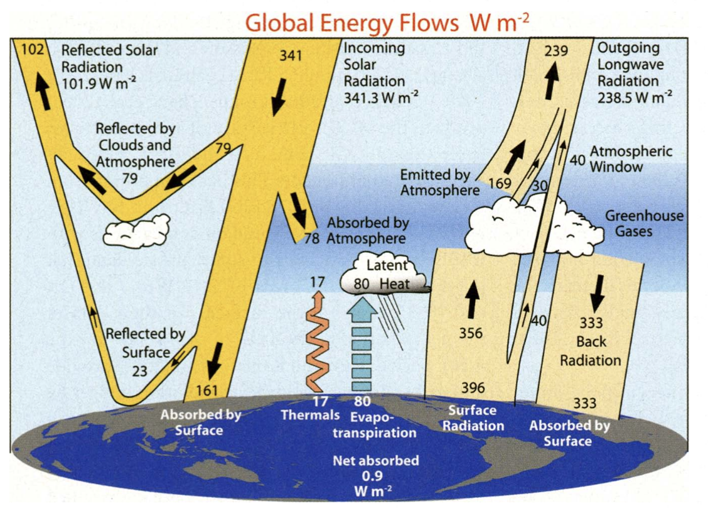
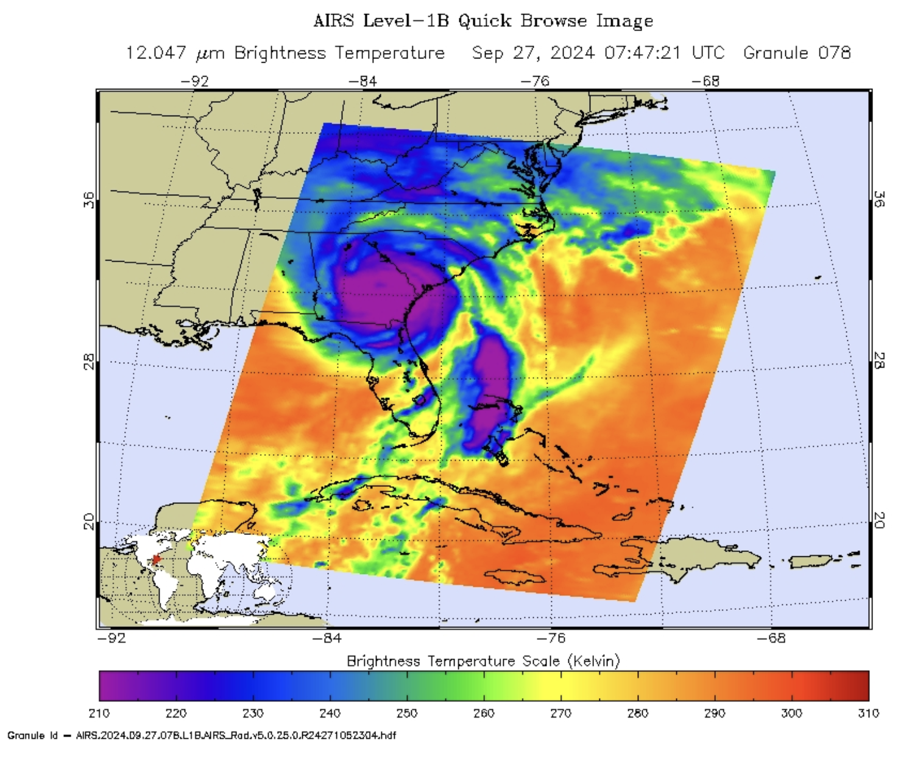
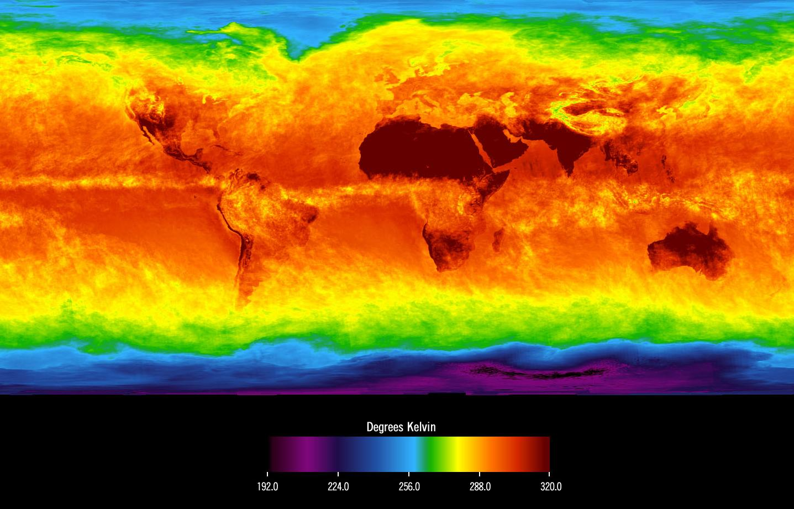
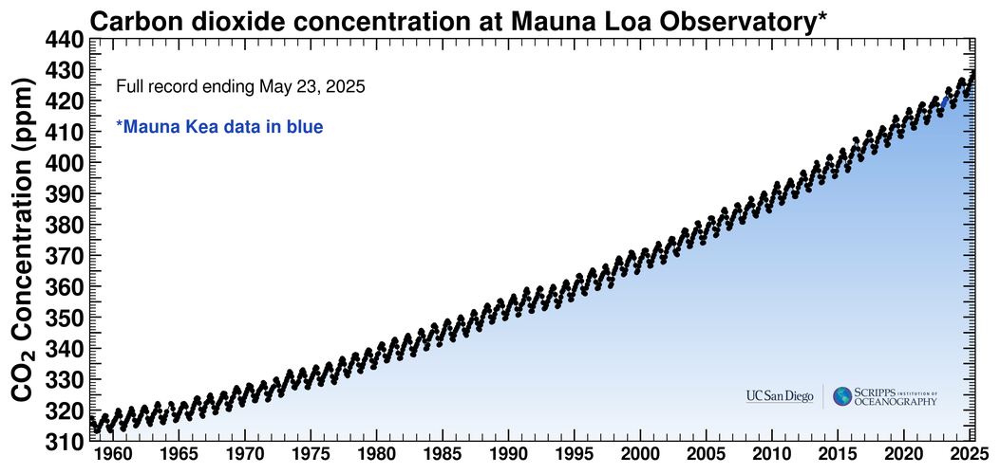
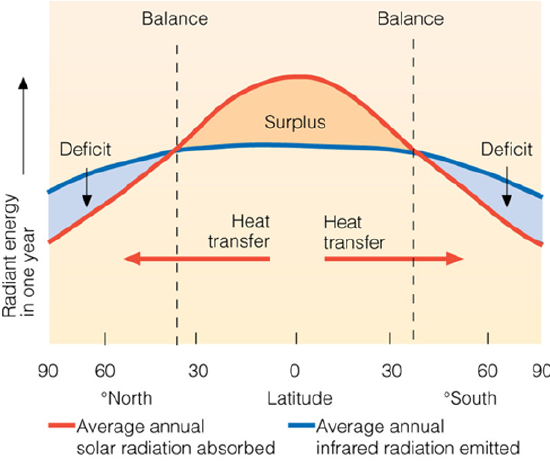

<h1> Global Energy Distribution </h1>

*“Ocean motions result from the overall forcing of the climate system but are filtered through various processes on different scales before arriving at the motions of interest for a particular application.”* -- [[BFK18](/air-sea-interactions-notes/references/#BFK18-ref)]

I like to start with this quote from Baylor Fox-Kemper because when we talk about scales of interest it really depends on your application. Each has their relative importance and necessity to understand and be curious about. 

## Global energy budget

When we talk about heat, we are referring to Joules, which is the amount of heat energy transferred or contained. Heat itself is energy. The rate at which thermal energy (heat) is transferred or converted is measured in J s$^{-1}$ - or Watts. In air-sea fluxes, we refer to this heat exchange as W m$^{-2}$, which is then the thermal energy generated per meter squared.

Globally, the Earth system is in a state of energy balance. The entire the Earth system - land surfaces, oceans, and atmosphere - absorbs an average of about 239 W m$^{-2}$. This reflects the balance between (1) the incoming solar (also called shortwave) radiation at the top of the atmosphere (~100 km above the earth’s surface) - about 341 W m$^{-2}$ - and (2) the shortwave radiation reflected by clouds, the atmosphere, and the Earth surfaces, which accounts for roughly just under a third at 102 W m$^{-2}$.

This shortwave radiation acts primarily in the wavelength range of 0.25-4 $\mu$m. In balancing Earth's energy budget, this is lost out the top of the atmosphere as outgoing longwave radiation, which falls within the infrared portion of the spectrum and has typical wavelengths of 4 to 30 $\mu$m.

  
  
<em>Global annual mean Earth's energy budget between 2000-2004. Arrows are scaled to their relative importance. Source: <a href="air-sea-interactions-notes/references/#TFK09">[TFK09]</a></em>

The balance between incoming solar radiation and outgoing radiation is crucial for maintaining the climate system. So the 239 W m$^{-2}$ emitted as longwave radiation back to space balances the absorbed solar radiation. This averaged view of the energy budget is more complex. For instance, the outgoing longwave radiation is highly variable and depends on the temperature of the object emitting the radiation, which follows the Stefan–Boltzmann law, described as the power radiated from a black body in terms of its temperature.

**The Stefan-Boltzmann law**\
\\[j^* = \epsilon \sigma T^4\\]

\\(j^*\\) is the radiant exitance, which is the power radiated per unit area in the form of electromagnetic radiation, with units W m$^{-2}$. \\(\epsilon\\) is a dimensionless property of the surface of an object that indicates how effectively it radiates energy compared to a perfect black body. The ocean has a high thermal emissivity, typically between 0.96 and 0.99. \\(\sigma\\) is the Stefan-Boltzmann constant that has a value of ~5.67 \\(\times\\) \\(10^{−8}\\) W m$^{-2}$ x K\\(^4\\). \\(T\\) is the absolute temperature in Kelvin (K).

### Measuring Earth's brightness temperature

The brightness temperature of the Earth is the temperature that a surface would need to have to emit the observed radiation intensity at a given wavelength or frequency. It is not a physical temperature but a radiometric one inferred from observed radiation. This is reflective of the outgoing longwave radiation. We can measure this from space using the Atmospheric Infrared Sounder (AIRS). The AIRS satellite detects infrared wavelengths in the range of 3.7 to 15.4 $\mu$m. It measures the intensity of radiation at these wavelengths to study atmospheric temperature, humidity, trace gases, and cloud properties. AIRS has 2378 spectral channels across this range, allowing for a detailed analysis of the atmosphere. 

Launched into Earth-orbit on May 4, 2002 aboard NASA's Aqua satellite, the AIRS provides data critical to the monitoring of Earth’s atmosphere. AIRS sees infrared wavelengths to sense the temperature of the Earth's surface or any intervening cloud (see image below). It reflects variations in the earth system’s latitude, altitude, and components (clouds, atmosphere, upper ocean, land, ice) responsible for infrared emissions. 

Below is an infrared image AIRS captured of Hurricane Helene on Friday, Sept. 27, 2024. One of the largest storms to develop in the Gulf of Mexico in the last century.

  
  
<em> Infrared image of Hurricane Helene September 27 after landfall. Credit: NASA/JPL-Caltech. Source: [https://airs.jpl.nasa.gov/news/287/nasas-airs-instrument-captures-hurricane-helene/](https://airs.jpl.nasa.gov/news/287/nasas-airs-instrument-captures-hurricane-helene/)</em>

If we average these kinds of images for long enough periods, we remove the weather component of Earth's brightness temperature. Below, the Earth's brightness temperature is shown for April 2003, similar to taking a photograph of the planet taken with the camera shutter held open for a month. 

The stationary features are captured while those obscured by moving clouds are blurred. Can you spot the continental features? For instance, you can see our planet's vast deserts, the high, cold Tibetan plateau to the north of India, and the mountains of North America. The band of yellow encircling the planet's equator is the Intertropical Convergence Zone (ITCZ), a region of persistent thunderstorms and high, cold clouds. The ITCZ merges with the monsoon systems of Africa and South America. Higher latitudes are increasingly obscured by clouds, though some features like the Great Lakes, the British Isles and Korea are apparent. Antarctica stands out cold and clear at the bottom of the image. [Info source](https://airs.jpl.nasa.gov/resources/170/global-average-brightness-temperature-for-april-2003/).

  
  
<em> Global Average Brightness Temperature for April 2003. Source: [https://airs.jpl.nasa.gov/resources/170/global-average-brightness-temperature-for-april-2003/](https://airs.jpl.nasa.gov/resources/170/global-average-brightness-temperature-for-april-2003/)</em>

If we take a global average of the brightness temperature (outgoing longwave radiation), we get a value of around -18 $^{\circ}$C. As you may guess, this is not the average temperature of Earth. It is more like 15 $^{\circ}$C, which we have determined by taking surface temperature measurements from weather stations, ships, and buoys over many decades. Why the difference? Greenhouse gasses.

## Greenhouse gas absorption

Greenhouse gases, including carbon dioxide, methane, water vapour, and others, absorb and re-emit outgoing longwave radiation at specific wavelengths in the Earth's atmosphere. This selective absorption occurs in particular bands of the infrared region of the electromagnetic spectrum, contributing to the greenhouse effect. 

The absorption spectrum (below) of a greenhouse gas like carbon dioxide or methane shows the specific wavelengths at which it absorbs infrared radiation. Carbon dioxide, for example, absorbs infrared radiation at wavelengths of around 2.7, 4.3, and 15 $\mu$m, while methane absorbs at around 3.3 $\mu$m. These absorption bands are often referred to as "windows" or "transmission bands", where the greenhouse gases allow some of the infrared radiation to pass through and escape into space.

By absorbing and re-emitting infrared radiation, greenhouse gases help to regulate the temperature of the Earth's atmosphere and surface. However, as the concentration of these gases increases due to human activities, the absorption of infrared radiation also increases, leading to an enhanced greenhouse effect and global warming.

  
  
<em> Amount of energy absorbed by greenhouse gases in various wavelength regions, from ultraviolet radiation on the left, to visible light in the middle, to infrared radiation on the right. This figure was prepared by Robert A. Rohde for the Global Warming Art project.</em>

## An imbalance

The increase of greenhouse gasses in Earth's atmosphere results in more heat (energy) remaining in the atmosphere. This means that Earth's energy budget shows a slight imbalance at the top of the atmosphere of about 0.9 W m$^{-2}$, indicating ongoing changes in the climate system. Climate scientists have been carefully monitoring this since the 1950's, with the most famous observational site the Mauna Loa Observatory in Hawaii.

  
  
<em>The Keeling Curve is the record of atmospheric CO2 from the Mauna Loa Observatory, starting in 1958 [https://keelingcurve.ucsd.edu/](https://keelingcurve.ucsd.edu/)</em>

## Global redistribution of energy

Latitudinal Energy Imbalance

The Earth's energy budget is not balanced uniformly across latitudes. Near the equator and in the tropics, there is a net energy surplus—these regions receive more incoming shortwave solar radiation than they emit as outgoing longwave radiation. In contrast, the mid-latitudes and polar regions experience a net energy deficit, emitting more longwave radiation to space than they receive from the Sun.

This imbalance is not constant and also varies:

- Seasonally (due to Earth's tilt),
- Diurnally (day vs. night),
- And longitudinally (due to land-ocean distribution, cloud cover, etc.).

The primary reason for the mismatch between incoming and outgoing energy is the atmospheric and oceanic circulation systems, which transport heat from energy-surplus regions to energy-deficit regions. This large-scale redistribution helps maintain a relatively stable global climate.

  
  
<em> Global heat redistribution. Source: NASA.</em>

### Poleward Heat Transport and Climate Regulation

The imbalance in energy input across latitudes is a key driver of winds and ocean currents. These systems transport heat from equatorial regions toward the poles. Without this redistribution, the polar regions would continually cool while the tropics would grow ever warmer.

To maintain global energy balance, this poleward energy transfer must equal the surplus at low latitudes. It totals approximately 5.7 petawatts (PW) in each hemisphere and occurs through three main mechanisms:

#### 1. Atmospheric Sensible Heat Transport (~3 PW)

- Dominated by large-scale circulation cells, especially Hadley Cells.
- Air ascends near the equator, moves poleward at high altitudes, descends in the subtropics, and returns at the surface.
- This circulation converts thermal energy into mechanical energy, much like a Carnot engine.
- The Coriolis force deflects surface winds, producing:
  - Equatorial easterlies,
  - Mid-latitude westerlies.

#### 2. Ocean Sensible Heat Transport (~2 PW)

- Surface currents move warm water poleward and cold water equatorward.
- Unlike the atmosphere, the ocean is primarily heated and cooled at the surface.
- Oceanic transport is driven by:
  - Wind stress (Ekman transport),
  - Thermohaline circulation,
  - Tides.
- Meridional (north-south) heat transport is poleward on average, but varies:
  - In the Atlantic, transport is northward at all latitudes,
  - In the Indian Ocean, it is southward at all latitudes.

#### 3. Latent Heat Transport (~1 PW)
- Involves the hydrological cycle: evaporation, transport of water vapor, and precipitation.
- Moist air carries latent heat as water vapor, which releases energy upon condensation.
- This process is called the “steam cycle.”
- Evaporating water takes 560 times more energy than warming it by 1 K—making latent heat a powerful heat carrier.
- Though the mass of water moved is small, the energy transported is significant.

