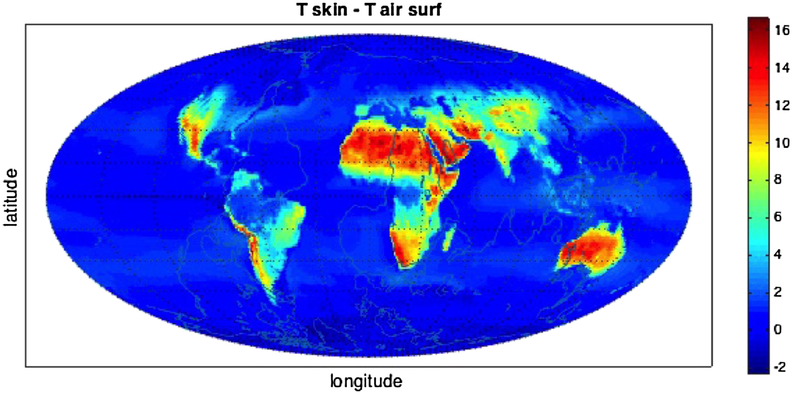

<h1> Global Energy Distribution </h1>

*“Ocean motions result from the overall forcing of the climate system but are filtered through various processes on different scales before arriving at the motions of interest for a particular application.”* -- [[BFK18](/references/#BFK18)]

I like to start with this quote from Baylor Fox-Kemper because when we talk about scales of interest it really depends on your application. Each has their relative importance and necessity to understand and be curious about. 

## Global energy budget

When we talk about heat, we are referring to Joules, which is the amount of heat energy transferred or contained. Heat itself is energy. A Watt is J s\\(^{-1}\\), which represents power -- the rate at which energy is transferred or converted. A Watt measures the rate of heat transfer or the rate at which thermal energy is being generated. When we talk about air-sea fluxes, we are talking in W m\\(^{-2}\\), the thermal energy generated per unit area.

Globally, over the year, the Earth system - land surfaces, oceans, and atmosphere - absorbs an average of about 239 W m\\(^{-2}\\). This reflects the balance between incoming solar (also called shortwave) radiation at the top of the atmosphere (~100 km above the earth’s surface) from the sun of about 341 W m\\(^{-2}\\) and the shortwave radiation reflected by clouds, the atmosphere, and the Earth surfaces, which accounts for roughly just under a third at 102 W m\\(^{-2}\\).

This shortwave radiation acts primarily in the wavelength range of 0.25-4 \\( \mu \\)m. In balancing Earth's energy budget, this is lost out the top of the atmosphere as outgoing longwave radiation, which falls within the infrared portion of the spectrum and has typical wavelengths of 4 to 30 \\( \mu \\)m.

  
  
<em>Global annual mean Earth's energy budget between 2000-2004. Arrows are scaled to their relative importance. Source: <a href="air-sea-interactions-notes/references/#TFK09">[TFK09]</a></em>

The balance between incoming solar radiation and outgoing radiation is crucial for maintaining the climate system. So the 239 W m\\(^{-2}\\) emitted as longwave radiation back to space balances the absorbed solar radiation. This averaged view of the energy budget is more complex. For instance, the outgoing longwave radiation is highly variable and depends on the temperature of the object emitting the radiation, which follows the Stefan–Boltzmann law, described as the power radiated from a black body in terms of its temperature.

**The Stefan-Boltzmann law**\
\\[j^* = \epsilon \sigma T^4\\]

\\(j^*\\) is the radiant exitance, which is the power radiated per unit area in the form of electromagnetic radiation, with units W m\\(^{-2}\\). \\(\epsilon\\) is a dimensionless property of the surface of an object that indicates how effectively it radiates energy compared to a perfect black body. The ocean has a high thermal emissivity, typically between 0.96 and 0.99. \\(\sigma\\) is the Stefan-Boltzmann constant that has a value of ~5.67 \\(\times\\) \\(10^{−8}\\) W m\\(^{-2}\\) x K\\(^4\\). \\(T\\) is the absolute temperature in Kelvin (K).

### Measuring Earth's brightness temperature

The brightness temperature of the Earth is the temperature that a surface would need to have to emit the observed radiation intensity at a given wavelength or frequency. It is not a physical temperature but a radiometric one inferred from observed radiation. This is reflective of the outgoing longwave radiation. We can measure this from space using the Atmospheric Infrared Sounder (AIRS). The AIRS satellite detects infrared wavelengths in the range of 3.7 to 15.4 \\( \mu \\)m. It measures the intensity of radiation at these wavelengths to study atmospheric temperature, humidity, trace gases, and cloud properties. AIRS has 2378 spectral channels across this range, allowing for a detailed analysis of the atmosphere. 

Launched into Earth-orbit on May 4, 2002 aboard NASA's Aqua satellite, the AIRS provides data critical to the monitoring of Earth’s atmosphere. AIRS sees infrared wavelengths to sense the temperature of the Earth's surface or any intervening cloud (see image below). It reflects variations in the earth system’s latitude, altitude, and components (clouds, atmosphere, upper ocean, land, ice) responsible for infrared emissions. 

Below is an infrared image AIRS captured of Hurricane Helene on Friday, Sept. 27, 2024. One of the largest storms to develop in the Gulf of Mexico in the last century.

  
  
<em> Infrared image of Hurricane Helene September 27 after landfall. Credit: NASA/JPL-Caltech. Source: [https://airs.jpl.nasa.gov/news/287/nasas-airs-instrument-captures-hurricane-helene/](https://airs.jpl.nasa.gov/news/287/nasas-airs-instrument-captures-hurricane-helene/)</em>

If we average these kinds of images for long enough periods, we remove the weather component of Earth's brightness temperature. Below, the Earth's brightness temperature is shown for April 2003, similar to taking a photograph of the planet taken with the camera shutter held open for a month. 

The stationary features are captured while those obscured by moving clouds are blurred. Can you spot the continental features? For instance, you can see our planet's vast deserts, the high, cold Tibetan plateau to the north of India, and the mountains of North America. The band of yellow encircling the planet's equator is the Intertropical Convergence Zone (ITCZ), a region of persistent thunderstorms and high, cold clouds. The ITCZ merges with the monsoon systems of Africa and South America. Higher latitudes are increasingly obscured by clouds, though some features like the Great Lakes, the British Isles and Korea are apparent. Antarctica stands out cold and clear at the bottom of the image. [Info source](https://airs.jpl.nasa.gov/resources/170/global-average-brightness-temperature-for-april-2003/).

  
  
<em> Global Average Brightness Temperature for April 2003. Source: [https://airs.jpl.nasa.gov/resources/170/global-average-brightness-temperature-for-april-2003/](https://airs.jpl.nasa.gov/resources/170/global-average-brightness-temperature-for-april-2003/)</em>

If we take a global average of the brightness temperature (outgoing longwave radiation), we get a value of around -18 \\(\degree\\)C. As you may guess, this is not the average temperature of Earth. It is more like 15 \\(\degree\\)C, which we have determined by taking surface temperature measurements from weather stations, ships, and buoys over many decades. Why the difference? Greenhouse gasses.

## Greenhouse gas absorption

Greenhouse gases, including carbon dioxide, methane, water vapour, and others, absorb and re-emit outgoing longwave radiation at specific wavelengths in the Earth's atmosphere. This selective absorption occurs in particular bands of the infrared region of the electromagnetic spectrum, contributing to the greenhouse effect. 

The absorption spectrum (below) of a greenhouse gas like carbon dioxide or methane shows the specific wavelengths at which it absorbs infrared radiation. Carbon dioxide, for example, absorbs infrared radiation at wavelengths of around 2.7, 4.3, and 15 \\( \mu \\)m, while methane absorbs at around 3.3 \\( \mu \\)m. These absorption bands are often referred to as "windows" or "transmission bands", where the greenhouse gases allow some of the infrared radiation to pass through and escape into space.

By absorbing and re-emitting infrared radiation, greenhouse gases help to regulate the temperature of the Earth's atmosphere and surface. However, as the concentration of these gases increases due to human activities, the absorption of infrared radiation also increases, leading to an enhanced greenhouse effect and global warming.

  
  
<em> Amount of energy absorbed by greenhouse gases in various wavelength regions, from ultraviolet radiation on the left, to visible light in the middle, to infrared radiation on the right. This figure was prepared by Robert A. Rohde for the Global Warming Art project.</em>

## An imbalance

The enhanced greenhouse effect means that global annual mean of Earth's energy budget shows a slight imbalance at the top of the atmosphere of about 0.9 \\( W \\) \\( m^{-2}\\), indicating ongoing changes in the climate system. This reflects the significant role of clouds and aerosols in reflecting and absorbing solar radiation, impacting the energy budget. 

## Summary of the Energy Flow Processes

- **Atmospheric Absorption**: Solar radiation absorbed by atmospheric components like water vapor, clouds, and aerosols.
- **Surface Absorption**: Solar radiation absorbed by the Earth's surface, contributing to heating the land and oceans.
- **Surface Emission**: The Earth's surface emits longwave radiation, which is partly absorbed by the atmosphere and partly escapes to space.
- **Back Radiation**: Longwave radiation emitted by the atmosphere back to the Earth's surface, contributing to the greenhouse effect.

## Global redistribution of energy

So far, we have only looked at a global view of things. But actually, latitude-by-latitude, the energy budget is not in balance. If like me, you've spend some time in the polar regions and the tropics, you'll have felt the difference. Equator and tropics receive excess incoming radiation over outgoing, mid-latitudes and polar latitudes emitting more energy back to space than from the sun. But the energy distribution of Earth also varies from season to season, day-to-night and longitude-by-longitude.

Consider this video of the monthly averaged net radiation, you can see the seasonal shifts in energy reaching the surface of the Earth.

<video src="assets/images/nasa-month-net-radiation.mp4" width="800" height="600" controls>
  Monthly net radiation. Source: NASA.
</video>

Another major factor infleuncing the way that heat is distribution around the global is seen in the figure below by [RALS17]. Why do we see the large differences in temperature between the Earth's surface and air just above it? Why are these larger over land compared to the ocean?

  
  
<em>The difference between the skin temperature and the surface air temperature retrieved from AIRS measurements. The maximum differences are seen over land, for example, in Africa and Australia. Source: [RALS17]</em>

This has got to do with specific heat capacity of dry air being \\( 1000 \\) \\(J \\) \\( kg^{-1} \\) \\( K^{-1} \\), and seawater \\( 4000 \\) \\(J \\) \\( kg^{-1} \\) \\( K^{-1} \\). For equal parts ocean and air, the ocean is able to hold about 4 times more heat than the air before warming to the same temperature, meaning the ocean will take considerably longer to warm given the same heat applied. In fact, the atmosphere has a total heat capacity near 107 \\(J \\) \\( m^{-2} \\) \\( K^{-1} \\), equal to about 3 meters of seawater. 

As a case study, if we applied 100 \\(W \\) \\( m^{-2} \\) heating to the atmosphere for one day, it would warm at about 1 \\(K \\). On the otherhand, the ocean with a mixed layer of 30 meters would only warm by about 0.1 \\(K \\).

The global energy distribution has important implications for setting large temperature differences between the equator and polar regions, which are important for wind generation and ocean currents. Winds and ocean currents play a major role in moving the surplus heat from the equatorial regions to the polar regions. Without this heat transfer, the polar regions of Earth would get colder every year and regions between ~ 35 \\( \degree \\)N and 35 \\( \degree \\)S would get warmer every year. If the whole system is to be in balance, there must be an exchange of energy between the excessive regions toward the deficient ones. There are three primary mechanisms that account for about 5.7 PW of poleward energy transport in each hemisphere. 

  
  
<em> Global heat redistribution. Source: NASA.</em>

#### Atmospheric sensible heat transport (3PW)

- Hadley Cells ascend near the equator, move poleward where they descend and return back toward the equator.
- Conversion of thermal energy to mechanical energy that drives the Hadley cell, much like a Carnot cycle. 
- These cells do not move directly from equator to pole, but are veered by the Coriolis force, so they have dominantly zonal winds at the surface. E.g. equatorial easterlies and mid-latitude westerlies.



### Ocean sensible heat transport (2 PW)

- Warm seawater moves poleward, and colder seawater moves equatorward.
- Unlike the atmosphere, oceans are heated and cooled at the surface, so they are not like heat engines. Instead, it must come from other sources, e.g., winds and tides.
- Meridional heat transport is poleward when zonally averaged, but the Atlantic is northward at all latitudes, and the Indian Ocean is southward at all latitudes.



#### Ocean latent heat transport (1 PW)

- Atmosphere/ocean latent heat transport is moist air moving poleward and dry air and liquid water in oceans and rivers moving equatorward.
- Vaporization releases heat that is transported from the location where evaporates to where the precipitation occurs - this is known as the  “steam cycle”.
- Moist air carries a lot of heat as it takes 560 times as much energy to evaporate water as to warm it by 1 degree. 
- Thus, although the hydrological cycle transports only a small mass of water it carries a lot of heat.

## General readings for this section

- [[BFK18](/air-sea-interactions-notes/#BFK18)]
- [[TFK09](/air-sea-interactions-notes/#TFK09)]
