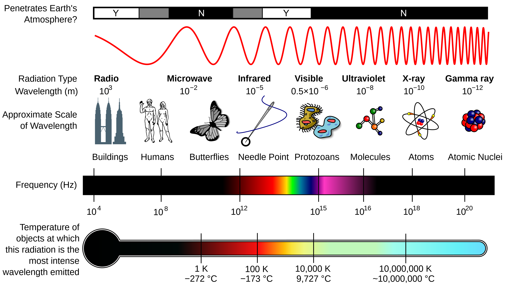

<h1> Global Energy Distribution </h1>

*“Ocean motions result from the overall forcing of the climate system but are filtered through various processes on different scales before arriving at the motions of interest for a particular application.”* -- [[BFK18](/air-sea-interactions-notes/#BFK18)]

I quite like this quote because when we talk about scales of interest it really depends on your application. Each has their relative importance and necessity to understand and be curious about.

## Global energy budget

The Earth's atmosphere receives its heat through solar radiation, which acts primarily in the wavelength range of 0.25-4 micrometres (µm). Meanwhile, outgoing longwave radiation falls within the infrared portion of the spectrum and has typical wavelengths of 4 to 30 µm.

  
  
<em>Radiation spectrum. Source: <a href="https://science.nasa.gov/ems/">https://science.nasa.gov/ems/</a></em>

Globally, over the year, the Earth system - land surfaces, oceans, and atmosphere - absorbs an average of about 239 watts of solar power per square meter (1 watt = 1 J/s).

Joule is a unit of energy that measures the energy required to create heat.

### What are some consequences of this energy uptake on Earth?

Fusion keeps the solar system warm, so presently the vast majority of the heating of the Earth and, thus, the motions of the atmosphere and oceans comes from the Sun’s energy. At the top of the atmosphere (~100 km above the earth’s surface), 341 W m$`^{-2}`$ of solar power arrives as primarily shortwave radiation. 102 W m$`^{-2}`$ of this shortwave radiation is reflected back to space, with about 239 W m$`^{-2}`$ entering the earth’s atmosphere.

  
  
<em>Global annual mean Earth's energy budget between 2000--2004. Arrows are scaled to their relative importance. Source: [TFK09]</em>

The Earth's energy budget involves the balance between incoming solar radiation and outgoing terrestrial radiation. This balance is crucial for maintaining the climate system.

### Components of the Energy Budget
Incoming Solar Radiation (Solar In) represents the solar energy that enters the Earth's atmosphere of approximately 341.3 W m$^{-2}$. Part of the incoming solar radiation is reflected back to space by clouds, aerosols, and the Earth's surface, which accounts for roughly just under a third (101.9 W m$^{-2}$). The remaining solar radiation is absorbed by the atmosphere and the Earth's surface, approximately 238.5 W m$^{-2}$.

The Earth emits longwave radiation back to space, balancing the absorbed solar radiation of about 238.5 W m$^{-2}$. The Stefan–Boltzmann law describes the power radiated from a black body in terms of its temperature.

**The Stefan-Boltzmann law**\
$$j^* = \sigma T^4$$

$$j^*$$ is the black-body radiant emittance, $$\sigma$$ has a value of 5.670374419 $$\times$$ 10$^{−8}$ W (m$^{2}$ x K$^4$), which represents the constant of proportionality between these two variables.

### Summary of the Energy Flow Processes

- **Atmospheric Absorption**: Solar radiation absorbed by atmospheric components like water vapor, clouds, and aerosols.
- **Surface Absorption**: Solar radiation absorbed by the Earth's surface, contributing to heating the land and oceans.
- **Surface Emission**: The Earth's surface emits longwave radiation, which is partly absorbed by the atmosphere and partly escapes to space.
- **Back Radiation**: Longwave radiation emitted by the atmosphere back to the Earth's surface, contributing to the greenhouse effect.

The energy in the Earth system is transported around in the following ways:

- **Latent Heat Flux**: Energy transported through the evaporation and condensation of water.
- **Sensible Heat Flux**: Direct heat transfer from the Earth's surface to the atmosphere.
- **Ocean Heat Transport**: Movement of heat within the ocean, affecting global climate patterns.

The figure shows a slight imbalance at the top of the atmosphere (TOA), indicating ongoing changes in the climate system. This reflects the significant role of clouds and aerosols in reflecting and absorbing solar radiation, impacting the energy budget. Improvements in satellite data and reanalysis methods have refined estimates of the energy budget components. There are sure to be updates.

### Measuring Earth's brightness temperature

The satellite observed brightness temperature by the Atmospheric Infrared Sounder (AIRS) at an infrared wavelength senses the Earth's surface or any intervening cloud. It reflects variations in the earth system’s latitude, altitude, and components (clouds, atmosphere, upper ocean, land, ice) responsible for infrared emissions.

  
  
<em> Global Average Brightness Temperature for April 2003. Source: [https://airs.jpl.nasa.gov/resources/170/global-average-brightness-temperature-for-april-2003/](https://airs.jpl.nasa.gov/resources/170/global-average-brightness-temperature-for-april-2003/)</em>

We can obtain beautiful images of the Earth's brightness temperature. In the image below, the average temperatures in April, 2003 are shown, observed by AIRS at an infrared wavelength that senses either the Earth's surface or any intervening cloud. Similar to a photograph of the planet taken with the camera shutter held open for a month, stationary features are captured while those obscured by moving clouds are blurred. Many continental features stand out boldly, such as our planet's vast deserts, and India, now at the end of its long, clear dry season. Also obvious are the high, cold Tibetan plateau to the north of India, and the mountains of North America. The band of yellow encircling the planet's equator is the Intertropical Convergence Zone (ITCZ), a region of persistent thunderstorms and associated high, cold clouds. The ITCZ merges with the monsoon systems of Africa and South America. Higher latitudes are increasingly obscured by clouds, though some features like the Great Lakes, the British Isles and Korea are apparent. The highest latitudes of Europe and Eurasia are completely obscured by clouds, while Antarctica stands out cold and clear at the bottom of the image. [Info source](https://airs.jpl.nasa.gov/resources/170/global-average-brightness-temperature-for-april-2003/).

The Earth's brightness temperature reflects thermal radiation emitted by the Earth. This temperature is estimated at around -18 C (global average). This temperature is mainly determined by the temperature of the Earth's atmosphere, which radiates thermal energy out into space, and the Earth's surface, which absorbs solar radiation and re-radiates some of it as thermal energy.

Earth's average temperature is around 15 C, based on surface measurements from weather stations, ships, and buoys over many decades. This temperature reflects the actual average temperature of the Earth's surface, which is influenced by various factors, including solar radiation, atmospheric circulation, ocean currents, and land surface characteristics.

The main reason for the difference between these two temperature measurements is the effect of the Earth's atmosphere. 

The Earth's atmosphere acts like a blanket, trapping some of the thermal radiation emitted by the Earth's surface and re-radiating it back towards the surface. 

This causes the surface temperature to be higher than the brightness temperature measured from space. 

Additionally, the surface temperature can be affected by other factors that are not detected by thermal sensors in space, such as local weather patterns and the influence of the ocean currents.

## Greenhouse gas absorption

The absorption spectrum of greenhouse gases refers to the specific wavelengths of electromagnetic radiation that are absorbed by these gases in the Earth's atmosphere. When sunlight passes through the atmosphere and reaches the Earth's surface, it includes a range of wavelengths, from ultraviolet to visible to infrared radiation. Some of these wavelengths are absorbed by the Earth's surface and then re-emitted as longer-wavelength infrared radiation, which is absorbed by greenhouse gases in the atmosphere.

The absorption spectrum of a greenhouse gas like carbon dioxide or methane shows the specific wavelengths at which it absorbs infrared radiation. These gases have several strong absorption bands in the infrared region, which correspond to specific molecular vibrations. Carbon dioxide, for example, absorbs infrared radiation at wavelengths of around 2.7, 4.3, and 15 micrometers, while methane absorbs at around 3.3 micrometers. These absorption bands are often referred to as "windows" or "transmission bands", where the greenhouse gases allow some of the infrared radiation to pass through and escape into space.

The absorption spectrum of greenhouse gases plays a crucial role in the Earth's energy balance and climate system. By absorbing and re-emitting infrared radiation, greenhouse gases help to regulate the temperature of the Earth's atmosphere and surface. However, as the concentration of these gases increases due to human activities, the absorption of infrared radiation also increases, leading to an enhanced greenhouse effect and global warming. Understanding the absorption spectrum of greenhouse gases is therefore essential for understanding the causes and impacts of climate change, and for developing strategies to mitigate its effects.

  
  
<em> Amount of energy absorbed by greenhouse gases in various wavelength regions, from ultraviolet radiation on the left, to visible light in the middle, to infrared radiation on the right. This figure was prepared by Robert A. Rohde for the Global Warming Art project.</em>

## Global redistribution of energy

Latitude-by-latitude, the energy budget is not in balance.

But also varies from season to season, day-to-night and longitude-by-longitude.

Equator and tropics receive excess incoming radiation over outgoing, mid-latitudes and polar latitudes emitting more energy back to space than from the sun.

Energy measured in Watts per meter squared (W m-2).

  
  
<em> Global heat redistribution. Source: NASA.</em>

The global heat redistribution has important implications for setting large temperature differences between the equator and polar regions, which are important for wind generation and ocean currents. Winds and ocean currents play a major role in moving the surplus heat from the equatorial regions to the polar regions. Without this heat transfer, the polar regions of Earth would get colder every year and regions between ~ 35 N and 35 S would get warmer every year.

However, this view of global heat distribution is a smoothed picture. What we experiene on Earth differs as we encounter seasons and weather. For instance, take this video from NASA of the monthly net radiation for each month of the year. We can see (and feel) the strong seasonal aspect to this global heat distribution, where summer months are associated with much higher temperatures than winter months.

<video src="assets/images/nasa-month-net-radiation.mp4" width="800" height="600" controls>
  Monthly net radiation. Source: NASA.
</video>

Another major factor infleuncing the way that heat is distribution around the global is seen in the figure below by [RALS17]. We do we see the large surface to air temperature differences that exist over land but not over the ocean?

  
  
<em>The difference between the skin temperature and the surface air temperature retrieved from AIRS measurements. The maximum differences are seen over land, for example, in Africa and Australia. Source: [RALS17]</em>

The reason for this has got to do with specific heat capacity of dry air being 1000 J kg-1 K-1, and seawater 4000 J kg-1K-1. For equal parts ocean and air, the ocean is able to hold about 4 times more heat than the air before warming to the same temperature, meaning the ocean will take considerably longer to warm given the same heat applied. In fact, the atmosphere has a total heat capacity near 107 J m-2 K-1, equal to about 3 meters of seawater. As a case study, if we applied 100 W m-2 heating applied to the atmosphere for a day, it would warm at about a degree Kelvin. On the otherhand, if we had an ocean surface mixed layer of 30 meters, it would only warm by about 0.1 K. 

### Atmospheric sensible heat transport (3PW)

- Hadley Cells ascend near the equator, move poleward where they descend and return back toward the equator.
- Conversion of thermal energy to mechanical energy that drives the Hadley cell, much like a Carnot cycle (Pauluis, 2011). 
- These cells do not move directly from equator to pole, but are veered by the Coriolis force, so they have dominantly zonal winds at the surface. E.g. equatorial easterlies and mid-latitude westerlies.



### Ocean sensible heat transport (2 PW)

- Warm seawater moves poleward, and colder seawater moves equatorward.
- Unlike the atmosphere, oceans are heated and cooled at the surface, so they are not like heat engines. Instead, it must come from other sources, e.g., winds and tides.
- Meridional heat transport is poleward when zonally averaged, but the Atlantic is northward at all latitudes, and the Indian Ocean is southward at all latitudes.
- Wind-driven circulation and thermohaline circulation are not distinct. We will begin to disentangle this in this course.



### Ocean latent heat transport (1 PW)

- Atmosphere/ocean latent heat transport is moist air moving poleward and dry air and liquid water in oceans and rivers moving equatorward.
- Vaporization releases heat that is transported from the location where evaporates to where the precipitation occurs - this is known as the  “steam cycle”.
- Moist air carries a lot of heat as it takes 560 times as much energy to evaporate water as to warm it by 1 degree. 
- Thus, although the hydrological cycle transports only a small mass of water it carries a lot of heat.

## Ocean heat content

Heat redistribution allows for the ocean to continuously absorb atmospheric heat

## General readings for this section

- BFK18
- TFK09

## Learning Goals

After working through this section, learners should be able to:

- Understand the Earth's energy budget
- Have a basic understanding of the Earth's energy imbalance
