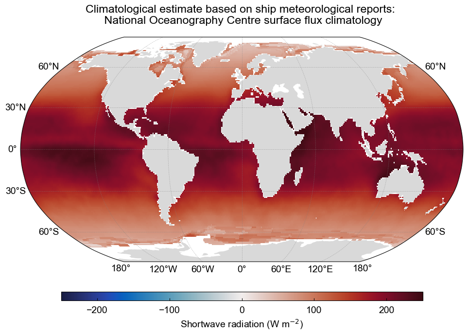

<h1> Radiation fluxes </h1>

The radiative fluxes in the earth system are often partitioned into shortwave and longwave components. These names refer to the wavelength of the electromagnetic waves which constitute the radiation. Radiative energy that reaches the ocean surface can do different things, depending on the temperature of the ocean and its albedo. 

<h2>Shortwave radiation</h2>

As we’ve seen, shortwave radiation is the primary driver of heating on Earth. Its distribution plays a crucial role in shaping weather patterns and the global climate system. Now, let’s explore the factors that determine how solar radiation is absorbed by the ocean. 

<h3>Surface Albedo</h3>

Shortwave radiation is emitted by the Sun arrives at the Earth’s surface in 8 minutes, on its path it is scattered, absorbed and reflected. As we have learned, the incoming shortwave radiation at the top of the atmosphere is 342 W m\\(^{-2}\\). However, the global average absorbed shortwave radiation by the ocean surface is approximately 170–180 W m\\(^{-2}\\). This value can vary depending on latitude, season, cloud cover, and albedo.

In terms of the radiation that reaches the ocean surface, the total absorbed by the ocean depends on the albedo:

\\[ Q_{\text{SW}\uparrow} = \alpha \cdot Q_{\text{SW}\downarrow} \\]

where:
- \\( Q_{\text{SW}\downarrow} \\)​: Incoming shortwave radiation — sunlight reaching the ocean surface.
- \\( Q_{\text{SW}\uparrow} \\): Reflected shortwave radiation — sunlight reflected back upward from the surface.
- \\( \alpha \\) Albedo — the fraction of incoming sunlight that is reflected by the surface.

Ocean albedo is low (typically 0.06–0.10), meaning most sunlight is absorbed, not reflected. However, changes in surface conditions (waves, foam, ice, etc.) can affect albedo and therefore this balance. For instance, sea ice albedo can range between 0.2 and 0.9, reflecting up to 90% of incoming sunlight. The figure below shows the strong albedo change between the ocean, ice, and land.

  
  
<em>Albedo of the Earth's surface.</em>

<h3>Shortwave penetrative radiation</h3>

Shortwave radiation can penetrate tens of meters into the ocean, unlike longwave radiation (which is absorbed in the top microns).

**Penetration is highly wavelength-dependent:**

- Blue/green light (shorter wavelengths) penetrates deepest (up to ~100 m in clear water).
- Red/infrared light is absorbed within the top few meters

In the clearest seawater, around 75% of entering Qsw is absorbed by 10 m depth. Meanwhile, in biologically productive or turbid waters will extinguish around 95% by 10 m.

The amount of shortwave radiation that reaches a given depth can be simplified to:

\\[ Q_{pen} = Q_{sw} e^{-kh} \\]

where:
- \\( Q_{pen} \\): the amount of shortwave radiation that reaches depth hh—i.e., how much of the original solar energy has penetrated to that depth.
- \\( h \\): depth in the water column, in meters (m). Sometimes it can be non-dimensional if scaled, but generally it's depth.
- \\( e^{-h} \\): exponential decay with depth. As you go deeper, less radiation is left because the water absorbs and scatters it.
- \\( k \\): the light attenuation coefficient (units: m⁻¹). It depends on water clarity, chlorophyll, and other optical properties.

The below figure shows an example for three commonly used water types in ocean models (Paulson and Simpson, 1977). \\( k \\) is approximated to 1.

  
  
<em>Penetration depth of shortwave radiation based on three different water types from Paulson and Simpson (1977) and the light attenuation coefficient approximated to 1.</em>

<h3>Global estimates of net shortwave radiation</h3>

The climatological estimate of shortwave radiation based on ship meteorological reports is shown below. The data is from the National Oceanography Centre surface flux climatology Version 1.1.

  
  
<em>The climatological estimate of shortwave radiation based on ship meteorological reports is shown below. The data is from the National Oceanography Centre surface flux climatology Version 1.1. Data source: <a href="ftp://ftp.noc.soton.ac.uk/pub/sxj/clim/netcdf/">National Oceanography Center UK</a></em>

<h2>Longwave radiation</h2>

The net longwave radiation (outgoing minus incoming) is a key part of the ocean surface energy budget. It represents a loss of heat from the ocean to the atmosphere, though some of that loss is offset by downwelling radiation from the atmosphere.

<h3>Outgoing longwave radiation</h3>

The ocean emits infrared radiation (longwave radiation) because it's warmer than the atmosphere above it. This follows the Stefan–Boltzmann law:

\\[
Q_{\text{LW} \uparrow} = \epsilon \sigma T_s^4
\\]

where:

\\( Q_{\text{LW} \uparrow} \\) is the emitted (upward) longwave radiation at the surface (W m\\(^{-2}\\)),

\\( \epsilon \\) is the surface emissivity (typically 0.97–0.99 for ocean),

\\( \sigma \\) is the Stefan–Boltzmann constant (5.67 \\( \times \\) 10\\(^{-8} \, \text{W} \, \text{m}^{-2} \, \text{K}^{-4} \\)),

\\( T_s \\) is the sea surface skin temperature (in Kelvin).

<h3>Incoming longwave radiation</h3>

The atmosphere emits infrared radiation downward toward the ocean surface. This is called downwelling longwave radiation and is also governed by Planck’s Law. It depends on:

- Atmospheric temperature
- Cloud cover and greenhouse gases
- Water vapor content

This incoming radiation partially offsets the ocean's longwave loss.

<h3>Net longwave radiation</h3>

The net longwave radiation flux is the **difference between incoming and outgoing** components:

\\[
Q_{\text{LW}} = Q_{\text{LW} \downarrow} - Q_{\text{LW} \uparrow}
\\]

where:

\\( Q_{\text{LW}} \\) is the net longwave radiation at the sea surface (W m\\(^{-2}\\)),

\\( Q_{\text{LW} \downarrow} \\) is the downwelling atmospheric radiation (W m\\(^{-2}\\)),

\\( Q_{\text{LW} \uparrow} \\) is the emitted ocean radiation, as defined above.

A negative \\( Q_{\text{LW}} \\) indicates a net **loss of energy** from the ocean to the atmosphere.

<h3>Emissivity</h3>

Emissivity is a measure of how efficiently a surface emits thermal radiation compared to a perfect blackbody (\\( \epsilon = 1 \\)). 

For the ocean, emissivity in the infrared range is high, typically between 0.97 and 0.99. This means the ocean emits nearly as much longwave radiation as a perfect emitter.

Atmospheric emissivity (affecting \\( Q_{\text{LW} \downarrow} \\)) varies more with temperature, moisture, and cloud conditions.

<h2>In-Situ Measurements</h2>

<h3>Pyranometers</h3>

(measuring SW downwelling)

<h3>Pyrgeometers</h3>

(measuring LW downwelling)

<h3>Ship-based radiation platforms</h3>

(e.g., RVs, fixed buoys like TAO, PIRATA)

<h2>Satellite Observations</h2>

<h3>CERES</h3>

(on NASA Terra/Aqua): Measures SW & LW radiative fluxes at TOA and surface (via model assimilation).

<h3>MODIS, VIIRS</h3>

Provide cloud properties & surface temperature, used in flux derivations.

<h2>Radiative Transfer Models</h2>

- Use satellite-derived inputs (clouds, aerosols, SST, humidity) to compute fluxes
- Examples: LBLRTM, RRTM, SBDART

<h2>Limitations</h2>

