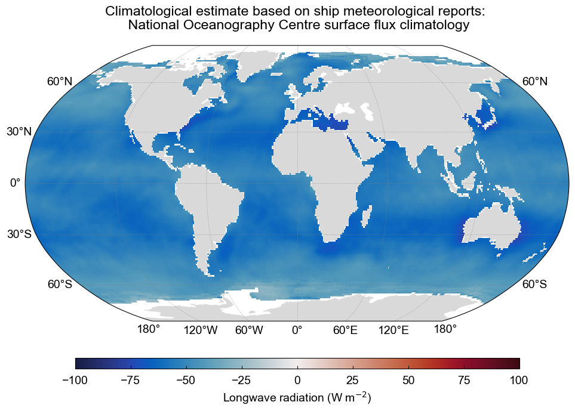

<h1> Radiative fluxes </h1>

The radiative fluxes in the earth system are partitioned into shortwave and longwave components. These names refer to the wavelength of the electromagnetic waves which constitute the radiation. Radiative energy that reaches the ocean surface can do different things, depending on the temperature of the ocean and its albedo. 

<h2>Shortwave radiation</h2>

As we’ve seen, shortwave radiation ($Q_{sw}$) is the primary driver of heating on Earth. Its distribution plays a crucial role in shaping weather patterns and the global climate system. Now, let’s explore the factors that determine how solar radiation is absorbed by the ocean. 

<h3>Surface Albedo</h3>

Shortwave radiation emitted by the sun arrives at the Earth’s surface in 8 minutes. On its path it is scattered, absorbed and reflected. While the global average of incoming shortwave radiation at the top of the atmosphere is 341 W m$^{-2}$, the amount absorbed by the ocean surface is approximately 170–180 W m$^{-2}$.

One factor contributing to this redcution in shortwave radiation absorbed by the ocean is the albedo effect, which explains the fraction of incoming sunlight that is reflected by the surface. The relationship between incoming and reflected shortwave radiation is given by:

\\[ Q_{\text{SW}\uparrow} = \alpha \cdot Q_{\text{SW}\downarrow} \\]

- \\( Q_{\text{SW}\downarrow} \\)​: Incoming shortwave radiation — sunlight reaching the ocean surface.
- \\( Q_{\text{SW}\uparrow} \\): Reflected shortwave radiation — sunlight reflected back upward from the surface.
- \\( \alpha \\) Albedo — the fraction of incoming sunlight that is reflected by the surface.

$\alpha$ varies between 0 and 1, with 0 representing complete absorption and 1 representing complete reflection. This value varies due to several factors, including the presence of clouds, sea ice, and surface roughness. On average, ocean albedo is low (typically 0.06–0.10), meaning most sunlight is absorbed by the ocean. However, different wave, foam, and ice conditions can affect albedo and therefore this balance. For instance, sea ice albedo can range between 0.2 and 0.9, reflecting up to 90% of incoming sunlight. 

<h3>Shortwave penetrative radiation</h3>

Unlike longwave radiation ($Q_{lw}$) - which is absorbed in the top microns of the surface ocean - $Q_{sw}$ penetrates to tens of meters deep and is often described by an exponential decay function. The rate of decay is determined depends on the water's clarity and the presence of particles and organisms that absorb or scatter light. In the clearest seawater, around 75% of entering shortwave radiation is absorbed by 10 m depth. Meanwhile, in biologically productive or turbid waters will extinguish around 95% by 10 m.

**The penetration depth is highly wavelength-dependent:**

- Blue/green light (shorter wavelengths) penetrates deepest (up to ~100 m in clear water).
- Red/infrared light is absorbed within the top few meters

The amount of shortwave radiation that reaches a given depth can be simplified to:

\\[ Q_{pen}(z) = Q_{sw} e^{-kz} \\]

- \\( Q_{pen} \\): the amount of shortwave radiation that reaches depth $h$, in W m$^{-2}$ — i.e., how much of the original solar energy has penetrated to that depth.
- \\( z \\): depth in the water column, in meters (m). Sometimes it can be non-dimensional if scaled, but generally it's depth.
- \\( e^{-z} \\): exponential decay with depth. As you go deeper, less radiation is left because the water absorbs and scatters it.
- \\( k \\): the light attenuation coefficient (units: m$^{-1}$). It depends on water clarity, chlorophyll, and other optical properties.

However, this simple model doesn't accurately capture the complex behavior of light penetration in different water conditions. To address this limitation, Paulson and Simpson (1977) [PS77][/air-sea-interactions-notes/references] developed a more sophisticated two-band exponential model.

**Two-Band Exponential Model**

Paulson and Simpson's model divides the solar spectrum into two parts:
1. A rapidly attenuating component (primarily red and infrared wavelengths)
2. A more slowly attenuating component (primarily blue and green wavelengths)

The mathematical formulation is:

\\[ Q_{pen}(z) = Q_{sw} \left[ R \cdot e^{-z/\zeta_1} + (1-R) \cdot e^{-z/\zeta_2} \right] \\]

- $R$ is the fraction of shortwave radiation that is rapidly attenuated
- $\zeta_1$ is the e-folding depth for the rapidly attenuating component
- $\zeta_2$ is the e-folding depth for the slowly attenuating component

**Jerlov Water Types**

Jerlov (1968)[[J68](/air-sea-interactions-notes/references)] classified ocean waters into different optical categories based on their transparency. This allows us to model the penetration depth of $Q_{sw}$ in different water types. [[#PS77](/air-sea-interactions-notes/references)] parameterized their two-band model for these Jerlov water types.

The three primary oceanic water types have the following parameters:

| Jerlov Type         | R (fraction)         | $\zeta_1$ (m)      | $\zeta_2$ (m)       | Description         |
|:--------------------|:--------------------:|--------------------|--------------------:|:--------------------|
| Type I              | 0.58                 | 1.20               | 28.0                | Clearest open ocean waters |
| Type II             | 0.77                 | 1.50               | 14.0                | Moderately clear waters |
| Type III            | 0.78                 | 1.40               | 7.9                 | More turbid waters |

The below figure shows an implementation of three commonly used water types in ocean models in the [[PS77](/air-sea-interactions-notes/references)] two-band parameterization. The surface shortwave radiation is set to 200 W m$^{-2}$.  

  
  
<em>Penetration depth of shortwave radiation based on three different water types from Paulson and Simpson (1977). The surface shortwave radiation is set to 200 W m$^{-2}$.</em>

The parameters show that:

- Type I waters are the clearest, allowing light to penetrate deepest. Only 58% of the radiation is rapidly attenuated, with the remaining 42% able to reach significant depths ($\zeta_2$ = 28m).
- Type II waters are moderately clear, with 77% of radiation rapidly attenuated and the remaining 23% penetrating to moderate depths ($\zeta_2$ = 14m).
- Type III waters are more turbid, with 78% of radiation rapidly attenuated and the remaining 22% penetrating to shallower depths ($\zeta_2$ = 7.9m) compared to clearer water types.

<h3>Global estimates of net shortwave radiation</h3>

The climatological estimate of $Q_{sw}$ taken from ship-based observations is shown below. The fields have been derived from the COADS1a (1980-93) dataset enhanced with additional metadata from the WMO47 list of ships [[JKT98](https://usclivar.org/sites/default/files/documents/2015/SOC_flux_atlas.pdf)]. It is important to note that the quality of the fields has a strong spatial
dependence which reflects the global distribution of ship observations. Quality is likely to be high in the well sampled North Atlantic & North Pacific but to decrease in the Southern Hemisphere. Still, the figure shows clear regional patterns and hints to the atmospheric and oceanic dynamics that influence how much $Q_{sw}$ is absorbed into the ocean. Can you identify these patterns?

  
  
<em>The climatological estimate of shortwave radiation based on ship meteorological reports. The data is from the National Oceanography Centre surface flux climatology Version 1.1. Data source: <a href="ftp://ftp.noc.soton.ac.uk/pub/sxj/clim/netcdf/">National Oceanography Center UK</a></em>

<h2>Longwave radiation</h2>

The net longwave radiation (outgoing minus incoming) is a key part of the ocean surface energy budget. It represents a loss of heat from the ocean to the atmosphere, though some of that loss is offset by downwelling radiation from the atmosphere.

<h3>Upwelling longwave radiation</h3>

The ocean emits infrared radiation ($Q_{\text{LW} \uparrow}$) because it's warmer than the atmosphere above it. This follows the Stefan–Boltzmann law:

\\[
Q_{\text{LW} \uparrow} = \epsilon \sigma T_{skin}^4
\\]

- \\( Q_{\text{LW} \uparrow} \\) is the emitted (upward) longwave radiation at the surface (W m\\(^{-2}\\)),
- \\( \epsilon \\) is the surface emissivity,
- \\( \sigma \\) is the Stefan–Boltzmann constant (5.67 \\( \times \\) 10\\(^{-8} \, \text{W} \, \text{m}^{-2} \, \text{K}^{-4} \\)),
- \\( T_{skin} \\) is the sea surface skin temperature (in Kelvin).

**Emissivity:**

Emissivity ($\epsilon$) is a measure of how efficiently a surface emits thermal radiation compared to a perfect blackbody (\\( \epsilon = 1 \\)), and varies with temperature, moisture, and cloud conditions. For the ocean, emissivity in the infrared range is high, typically between 0.97 and 0.99. This means the ocean emits nearly as much longwave radiation as a perfect emitter.

<h3>Downwelling longwave radiation</h3>

The atmosphere emits infrared radiation downward toward the ocean surface ($Q_{\text{LW} \downarrow}$). This is called downwelling longwave radiation and is also governed by Planck’s Law. It depends on:

- Atmospheric temperature
- Cloud cover and greenhouse gases
- Water vapor content

This incoming radiation partially offsets the ocean's longwave loss.

<h3>Net longwave radiation</h3>

The net longwave radiation flux is the **difference between incoming and outgoing** components:

\\[
Q_{\text{LW}} = Q_{\text{LW} \downarrow} - Q_{\text{LW} \uparrow}
\\]

A negative \\( Q_{\text{LW}} \\) indicates a net **loss of energy** from the ocean to the atmosphere.

<h3>Global estimates of net longwave radiation</h3>

As above, the climatological estimate of $Q_{lw}$ taken from ship-based observations is shown [[JKT98](https://usclivar.org/sites/default/files/documents/2015/SOC_flux_atlas.pdf)]. Can you identify the ocean dynamics that influence the regional patterns of $Q_{lw}$?

  
  
<em>The climatological estimate of net longwave radiation based on ship meteorological reports. The data is from the National Oceanography Centre surface flux climatology Version 1.1. Data source: <a href="ftp://ftp.noc.soton.ac.uk/pub/sxj/clim/netcdf/">National Oceanography Center UK</a></em>

<h2>Measuring radiation at sea</h2>

Making climate quality meteorological and flux measurements at sea is difficult, and a lot of work has been done to communicate best practices. One guiding document is [A guide to making climate quality meteorological and flux measurements at sea](https://repository.library.noaa.gov/view/noaa/17408) by Bradley and Fairall (2007).

<h3>Pyranometers</h3>

To measure the downwelling shortwave radiation at sea, we use pyranometers. 

A pyranometer is a sensor that measures hemispherical solar irradiance (i.e., radiation from the entire sky dome) on a flat surface. It is used to measure the solar radiation received from above ($Q_{\text{sw}\downarrow}$). It typically measures radiation over the wavelength range of approximately 0.2-2.8 $\mu$m — capturing the bulk of shortwave radiation from the sun. 

**How pyranometers work:**

Solar radiation passing through the glass dome of the pyranometer impinges on a flat thermopile with a blackened upper surface. The thermopile output has a linear response to the radiative intensity, and so generates a voltage (in $\mu$V) proportional to the net radiant energy it absorbs that is converted to irradiance (W m$^{-2}$) using a calibration factor. Accuracy of the instrument is usually quoted as 2%.

The sensor surface is protected by glass domes that:
- Transmit shortwave radiation (~0.2-2.8 $\mu$m)
- Block longwave radiation (>4 $\mu$m)
- Protect against environmental contaminants (e.g., salt spray, dust).

  
  
<em>SPN1 Pyranometer often used for at-sea measurements of downwelling shortwave radiation. Source: <a href="https://delta-t.co.uk/product/spn1/">Delta T</a></em>

<h3>Pyrgeometers</h3>

To measure the downwelling longwave radiation ($Q_{\text{lw}\downarrow}$) we use pyrgeomters. A pyrgeometer measures thermal infrared radiation, typically >4 $\mu$m. It is used to measure the amount of infrared radiation emitted by the atmosphere and clouds. 

**How pyrgeometers work:**

The pyrgeometer works by determining its own thermal balance, combining the contributions from dome and case temperatures with ($Q_{\text{lw}\downarrow}$) through the silicon window. The pyrgeometer measures the difference in temperature between the blackened detector and the ambient air temperature inside the dome. The detector is a blackened surface inside the dome which is detected with a thermopile.

The core part is a thermopile sensor with a dome-shaped window made of a material (e.g. silicon or germanium) that transmits longwave radiation. It usually has a blackened surface to absorb radiation and a temperature sensor (often a thermistor) to record the instrument’s body temperature.

The net signal is used to calculate downwelling longwave radiation using an energy balance formula.

  
  
<em>Kipp & Zonen pyrgeometer installed onto the atmospheric mast of the R/V S.A. Agulhas II.</em>

**Key considerations:**

Both pyranometers and pyrgeometers are small (about the size of a your fist), and so can be installed on many different platforms including on buoys (e.g., TAO/TRITON array in the tropical Pacific), on ship masts (carefully sited to minimize shading and reflection), and autonomous vehicles.

Accurate deployments of these sensors to measure $Q_{sw}$ and $Q_{lw}$ require several key considerations that include:

- Tilt corrections: The platform (ship or buoy) may tilt due to waves, causing measurement errors. Some systems apply real-time corrections using motion sensors (IMUs).
- Shading: Structures (like masts) can shade the sensor. Good installation minimizes this.
- Reflections (albedo): At the sea surface, some shortwave radiation is reflected back into the atmosphere. Pyranometers measure incoming radiation only; separate instruments (e.g., up-looking pyranometers) are needed to measure reflected radiation and calculate surface albedo.
- Salt spray and contamination: Can reduce transmission through the domes. Regular cleaning or self-cleaning domes are used on autonomous platforms.

**Recommended practices:**
    - Horizon should be clear.
    - Avoid shadowing and reflected IR from ship structures.
    - Use gimbals or stabilization platforms if possible.

