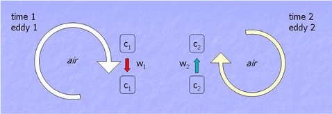
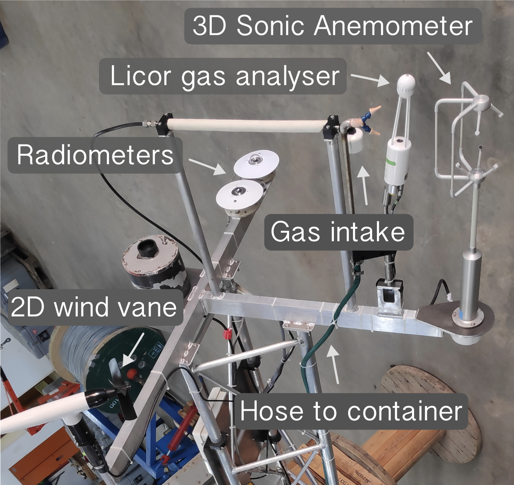
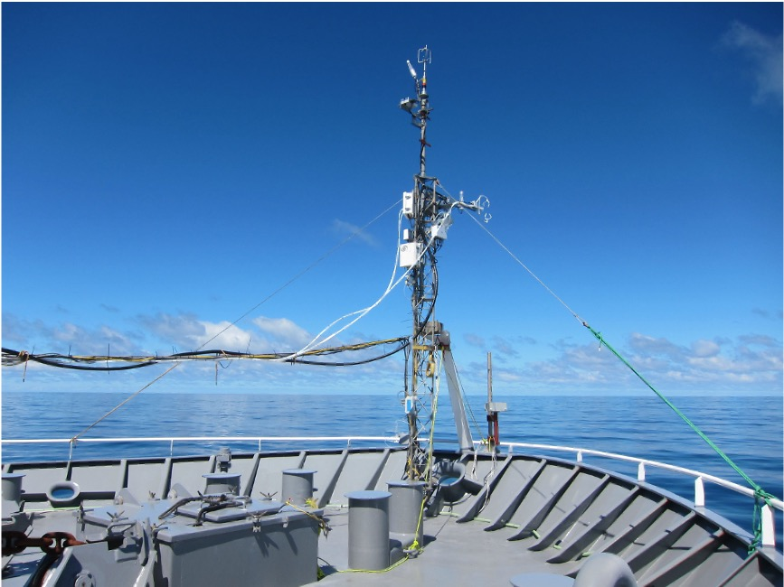

<h1> Turbulent fluxes </h1>

The two most commonly applied approaches to quantifying air-sea exchanges: the **eddy covariance method** and the **bulk flux method**. This section outlines the basic theory of each, and how to observe them. At the end, you should be able to:

- Compare and constrast the eddy covariance and bulk flux method for obtaining air-sea exchange
- Discuss the advantages and disadvantages of the two methods
- Outline the main instrumentation required to obtain each estimation of the flux

<h2>Eddy Covariance</h2>

The eddy covariance method is a direct measurement technique -- sometimes called direct covariance -- used to measure the flux of momentum, heat, and gases at the air-sea interface. In the atmospheric bounary layer, turbulent eddies of size 1-100 m and evolutionary time scales of seconds to minutes carry properties towards and away from the surface ocean. The eddy covariance method therefore relies on measurements of wind velocity, temperature, and scalar quantities like humidity or \\( CO_2 \\) concentration at scales much faster than the evolution of eddies, typcially at 10 or 20 Hz.

<h3>Governing Equation:</h3>

If we are interested in a quantity \\( c \\), it can be separated into its mean and fluctating parts:

\\[ c = \overline{c} - c' \\]

\\( \overline{c} \\) is the mean component, while \\( c' \\) is the flucutating term.

The flux of the scalar quantity \\( c \\) is given by:

\\[ F = \overline{w'c'} \\]

- \\( w' \\): Vertical wind speed fluctuation
- \\( c' \\): Scalar quantity fluctuation (e.g., temperature, humidity)
- \\( \overline{w'c'} \\): Time-averaged covariance of \\( w' \\) and \\( c' \\)

  
  
<em>Schematic of the transport of a quantity c by turbulent motion. Source: <a href="/references/#BA10">[BA10]</a></em>

### Frozen Taylor hypothesis

If we imagine a simultaneous measurement the water vapour concentration \\( q \\) (\\( \mu mol \\) \\( mol^{-1} \\)) and vertical wind speed \\( w \\) of a large number of \\( N \\) air volumes at the same height above the surface, the vertical flux of the water flux (i.e. latent heat flux) is given by the average over all measurements. The simultaneous measurement at \\( N \\) locations \\( p_j \\) is not very feasible. However, under the assumption of homogeneity in space and time, multiple measurements at the same point will lead to the same result. This is called Taylor "frozen turbulence" hypothesis.

### Marine Atmospheric Boundary Layer Turbulence

This video shows a Large Eddy Simulation of the marine atmospheric boundary layer. It demonstrates how winds, convection, and surface waves combine in complex ways to drive momentum and scalar transport in the marine atmospheric boundary layer. You can visualise the turbulent eddies in various parameters on display to get a sense of the small-scale nature of the atmopsheric eddies that generate turbulent air-sea exchange.



<h3>Observational methods:</h3>

There are several ways to obtain eddy covariance measurements at sea. The most common is using ship-based observations, while others include moored buoys, drifting spar buoys, and autonomous vehicles. Each come with their own set of complications.

**Primary instruments:**

The fundamental instruments needed to obtain eddy covariance measurements are: 

- 3-dimensional sonic anemometer for x, y, and z direction wind speeds and fast response temperature.
- Infrared gas analysers for water vapour and \\( CO_2 \\) concentrations.

  
  
<em>Sensors installed on an eddy covariance mast in preperatation for the Benguela Flux Experiment. Key sensors for determining the net heat budget include the sonic anemometer, infrared gas analyser, and radiometers. Source: Dr. Brian Ward</em>

**Ship-based eddy covariance flux measurements**:

Ship-based eddy covariance instruments should be installed to minimise the effect of flow distortion. The flux instrumentation is usually mounted on an arm pointing out from a bow mast or boom and flux measurements are restricted to a wind sector where minimal flow distortion effects are expected, (i.e., when the ship is pointed into the wind field.)

  
  
<em>Image of an eddy covariance setup on a ship. You will notice different anemometers are installed for redundency. This is an important way to validate measurements. Source: Dr. Brian Ward</em>

<h3>Sources of errors:</h3>

**Flow distortion**:

Air-sea flux measurements require a platform, typically a vessel or a buoy. The presence of the platform superstructure and the instrument themself cause a distortion of the wind field and lead to acceleration or deceleration of the wind speed. This can lead to errors in the wind speed in the order of 10%, even at well exposed measurement locations, (e.g Yelland et al., 2002; Popinet et al., 2004).

**Motion correction**:

These platforms are also subject to pitch, roll, and yaw motion. The wind speed needs to be corrected from the platform framework \\( i,j,k \\) to a Earth reference frame \\( x,y,z \\). The measured wind speeds are transformed form the instantaneous platform coordinate system in the fixed earth coordinate system by means of the Euler transformation. If the anemometer is not perfectly aligned with the mean wind direction or the local vertical, errors in the measured vertical wind component can occur. Furthermore, time lags between motion sensors and wind measurements can create alignment errors in the motion correction algorithm.

<h3>Sea temperature corrections</h3>

The potential temperature variable used in the turbulent flux equations \\( \theta_s \\) refers to to the skin temperature of the surface ocean. This is difficult to directly observe and requires specialised infrared radiometers. Instead, the most commonly used \\( \theta_s \\) in observations is the near-surface measured temperature, typically measured a few meters below the sea surface (e.g. from a ship thermosalinograph). 

#### Cool skin

#### Warm layer

<h3>Relative wind corrections</h3>

<h3>Key Features:</h3>

- **Direct Measurement**: Captures turbulent fluxes by resolving small-scale atmospheric eddies.
- **High Temporal Resolution**: Requires fast-response sensors (e.g., sonic anemometers, infrared gas analyzers).
- **Complexity**: Sensitive to sensor alignment, platform motion (e.g., ship or buoy), and environmental noise.

<h3>Advantages:</h3>

- Provides high accuracy for turbulent fluxes.
- Useful for research-grade measurements.

<h3>Limitations:</h3>

- Requires expensive instrumentation.
- Challenging to deploy in harsh marine environments.

The exchange of momentum and energy between the atmosphere and ocean is difficult to measure directly over the ocean. Instead, oceanographers and meteorologists often rely on bulk formula that relates the fluxes to more easily measured averaged wind speed, temperature and humidity.

<h2>Bulk Flux Method</h2>

The bulk flux method is an indirect approach that estimates air-sea fluxes using empirical parameterizations based on mean meteorological and oceanographic variables. 

The bulk flux transfer of heat, momentum, moisture and gases follows the gradient-transfer theory, eddy diffusivity theory, or mixing length theory which assumes that the flux is proportional to and directed down the local gradient. For instance, take the turbulent flux of temperature:

\\[ F = \overline{w' \theta'} = -K \frac{\partial \theta}{\partial z} \\]

Parameter \\( K \\) is prescribed to increase with the intensity of turbulence, with varies with height above the ground, mean wind shear and surface heating by the sun. 

The bulk formula is used to estimate the turbulent heat fluxes (latent and sensible) and the frictional force of wind blowing across the sea surface transfering momentum to the ocean, driving surface currents and waves (momentum flux). 

<h3>Bulk Flux Formulas:</h3>

**Sensible heat flux**:
    
\\[ Q_{sen} = \rho_a c_p C_H U (\theta_s - \theta_a) \\]
    
where: 
- \\( Q_{sen} \\): Sensible heat flux
- \\( \rho_a \\): air density
- \\( c_p \\): specific heat capacity of air at constant pressure
- \\( C_H \\): bulk transfer coefficient for heat
- \\( U \\): wind speed at reference height of 10 m above sea level
- \\( \theta_s, \theta_a \\): potential temperature at surface skin and 2 m above sea level

**Latent heat flux**:

\\[ Q_{lat} = \rho_a L_v C_E U (q_s - q_a) \\]
    
where: 
- \\( Q_{lat} \\): latent heat flux
- \\( L_v \\): latent heat of vaporization
- \\( C_E \\): latent heat transfer coefficient
- \\( q_s, q_a \\): specific humidity at the surface and air at 2 m above sea level

**Momentum flux**:
        
\\[ \tau = \rho_a C_D U^2 \\]

where: 
- \\( \tau \\): wind stress
- \\( C_D \\)​: drag coefficient

The fluxes are sensitive to the choice of exchange parameters \\( C_D, C_H, and C_E \\). So let's learn about them. First, we need to understand  the Monin-Obukhov Similarity Theory (MOST).

<h3>Bulk flux transfer coefficients:</h3>

**Bulk transfer coefficient for sensible and latent heat (with stability correction):**

\\[
C_H = \frac{k^2}{\left( \ln\left( \frac{z}{z_{0h}} \right) - \psi_h \right)^2}
\\]

\\[
C_E = \frac{k^2}{\left( \ln\left( \frac{z}{z_{0q}} \right) - \psi_q \right)^2}
\\]

where:
- \\( \kappa \\) is the von Kármán constant (≈ 0.4)
- \\( z_{0h} \\), and \\( z_{0q} \\) are the roughness length scale for heat and moisture
- \\( \psi_h \\), and \\( \psi_q \\) stability correction function for heat, and moisture

**Roughness length**

The roughness lengths \\( z_{0h} \\), and \\( z_{0q} \\) describes how easily sensible heat (temperature) and latent heat (moisture) are exchanged between the ocean surface and the atmosphere through turbulence and molecular diffusion.

To determine these, first the roughness length for momentum (\\( z_{0m} \\)) must be obtained. In COARE, \\( z_{0m} \\) depends on the friction velocity (\\( u_* \\))​ and the properties of the surface (waves, viscosity):

\\[
  z_{0m} = \frac{c_0}{g} u_*^2 + \frac{c_1 \nu}{u_*}
\\]

where:
- \\( c_0, c_1 \\) are constants
- \\( g \\) is gravity,
- ν is the kinematic viscosity of air that depends slightly on temperature and pressure, but about 1.5 × 10\\( ^{-5}\\) m\\(^{2}\\) s\\(^{-1}\\)
- \\( u_* \\),​ is friction velocity (depends on wind speed and drag coefficient).

For calm seas the roughness length is small, meaning the friction between the atmosphere and the ocean is lower, while in a storm or choppy seas the roughness length is larger, and there is more friction between the ocean and atmosphere.

Then roughness Reynolds number \\( Re_* \\)​ is determined

\\[
Re_* = \frac{u_* z_{0m}}{\nu}
\\]

Once you have \\( Re_* \\)​, you use an empirical relation to find the ratio between \\( z_{0m} \\)​ and \\( z_{0h}, z_{0q} \\):

\\[
\log\left( \frac{z_{0m}}{z_{0h}} \right) = A + B Re_*^{-2/3}
\\]

- Roughness length for latent heat
\\[
\log\left( \frac{z_{0m}}{z_{0q}} \right) = A + B Re_*^{-2/3}
\\]

A and B are empirical constants:

In COARE 3.5, typical values are:
- A=2.67
- B=0.5

Solve for \\( z_{0h}, z_{0q} \\).

**Stability function**

The formula for stability function (both sensible and latent heat)

% For stable conditions (i.e. cool ocean, warm atmosphere):
\\[
\psi = - \frac{1}{2} \ln\left( \frac{1 + \sqrt{1 + 10 \frac{z}{L}}}{2} \right) + 2 \tan^{-1}\left( \frac{1}{\sqrt{10 \frac{z}{L}}} \right)
\\]

% For unstable conditions (i.e. warm ocean, cool atmosphere):
\\[
\psi = \ln \left( \frac{1 + \sqrt{1 + 10 \frac{z}{L}}}{2} \right)
\\]

- \\(z\\) = height of measurement (often 10 m).

The Monin-Obukhov length \\(L\\) (for temperature) and \\( L_q \\)​ (for moisture) depend on the surface fluxes and boundary layer stability:

- \\(L\\) (for sensible heat) is related to temperature flux and friction velocity.
- \\( L_q \\)​ (for latent heat) is related to the moisture flux and wind speed.

<h3>Monin-Obukhov Similarity Theory:</h3>

MOST provides a framework to describe the vertical structure of the turbulent atmosphere near the surface. It relates turbulent fluxes of heat, momentum, and moisture to mean gradients in wind speed, temperature, and humidity. It represents the height at which buoyant production of turbulence is comparable to mechanical (shear) production. It can be defined as:

\\[ L = -\frac{u_*^3}{\kappa \left( \frac{g}{T} \right) \overline{w'\theta'_v}} \\]

where: 
- \\( T \\) = mean virtual temperature
- \\( \overline{w' \theta'_v} \\) = kinematic virtual potential temperature flux

The interpretation of \\( L \\) can be summarised below:

| Stability           | Sign of L      | Description                         |
|---------------------|----------------|-------------------------------------|
| **Stable**          | L>0            | Buoyancy suppresses turbulence      |
| **Neutral**         | L→∞            | No buoyant effects, shear-dominated |
| **Accuracy**        | L<0            | Buoyancy enhances turbulence        |

<h3>Transfer Coefficient Under MOST</h3>

Under MOST, the transfer coefficient \\( C_H \\)​ is not constant, but varies with stability:

Effect of Stability:

- Unstable (\\( L < 0 \\)): \\( \phi_H < 0 \\) → larger \\( CH \\) → enhanced heat flux
- Stable (\\( L > 0 \\)): \\( \phi_H > 0 \\) → smaller \\( CH \\)​ → suppressed heat flux
- Neutral (\\( \abs L \abs \\) → ∞): \\( \phi_H = 0 \\), logarithmic profile applies

<h3>Coupled Ocean Atmosphere Response Experiment</h3>

The variation of fluxes between the ocean and the atmosphere is very sensitive to the choice of parameterization. Therefore, to thoroughly test the transfer coefficients and refine them for the Tropical Oceans, the Coupled Ocean-Atmosphere Response Experiment (COARE) was conduction. COARE was a large-scale field study conducted in the western Pacific Ocean from 1992-1993, with the objective to improve our understanding of the interaction between the ocean and atmosphere, particularly in the tropics, where the exchange of heat, moisture, and momentum between the two can significantly impact weather and climate.

The international TOGA-COARE field program which took place in the western Pacific warm pool over 4 months from November 1992 to February 1993 (Fairall et al. 1996a, 1996b, 1997) spurred the development of the COARE algorithm. The COARE algorithm was developed to provide a consistent and accurate method for estimating these fluxes under a wide range of atmospheric and oceanic conditions. This resulted in the COARE algorithm commonly used in models today. The COARE algorithm is based on a bulk formula approach.

The COARE algorithm has undergone a series of improvements focusing on the exchange parameters \\( C_D, C_H, C_E \\), which depend on the sea state that encompasses breaking waves and turbulence. 

History of COARE development:

- COARE 1.0 (1994): Introduced the basic formulation of the algorithm, including the effects of stability, gustiness, and the cool-skin layer [[FBR+96](/references/#FBR+96)]
- COARE 2.0 (1996-1997): Improved roughness length formulations, better treatment of stability, and updates to the cool-skin parameterization [[FBG+96](/references/#FBR+96)]
- COARE 3.0 (2003): Significant improvements in the representation for low-wind speed regimes, surface roughness for different sea states, and high-wind conditions. It became the default standard in many operational and climate models [[FBH+03](/references/#FBH+03)]
- COARE 3.5 (2011): Enhanced performance in low-wind and very high-wind (storm) regimes. Adjustments to roughness length at high wind speeds [[EJW+13](/references/#EJW+13)]  
- COARE 4.0 (Developmental): Under ongoing development/testing. Aims to further refine high-wind performance, enhance sea state coupling, and incorporate wave models and more advanced turbulence treatments.

<h3>Key Features:</h3>
- **Parameterization-Based**: Relies on bulk formulas derived from observational data.
- **Widely Used**: Suitable for operational models and large-scale studies.
- **Simpler Setup**: Requires standard meteorological measurements (e.g., wind speed, air temperature, sea surface temperature).

<h3>Advantages:</h3>
- Computationally efficient.
- Applicable over large spatial and temporal scales.

<h3>Limitations:</h3>
- Accuracy depends on the quality of parameterizations.
- Assumes steady-state and horizontally homogeneous conditions.

<h2>Comparison of Methods</h2>

| Feature                | Eddy Covariance        | Bulk Flux              |
|------------------------|------------------------|------------------------|
| **Measurement Type**   | Direct                 | Indirect               |
| **Complexity**         | High                   | Moderate               |
| **Accuracy**           | High (turbulent fluxes)| Moderate               |
| **Deployment**         | Research-grade         | Operational            |
