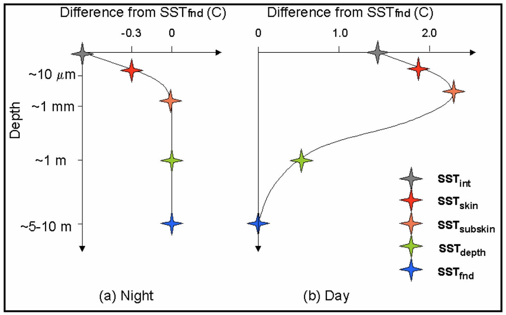

<h1> Turbulent fluxes </h1>

The two most commonly applied approaches to quantifying air-sea exchanges: the **eddy covariance method** and the **bulk flux method**. This section outlines the basic theory of each, and how to observe them. At the end, you should be able to:

- Compare and constrast the eddy covariance and bulk flux method for obtaining air-sea exchange
- Discuss the advantages and disadvantages of the two methods
- Outline the main instrumentation required to obtain each estimation of the flux

<h2>Eddy Covariance</h2>

The eddy covariance method is a direct measurement technique -- sometimes called direct covariance -- used to measure the flux of momentum, heat, and gases at the air-sea interface. In the atmospheric bounary layer, turbulent eddies of size 1-100 m and evolutionary time scales of seconds to minutes carry properties towards and away from the surface ocean. The eddy covariance method therefore relies on measurements of wind velocity, temperature, and scalar quantities like humidity or CO$_2$ concentration at scales much faster than the evolution of eddies, typcially at 10 or 20 Hz. The eddy covariance method is the most accurate method for measuring air-sea fluxes, but it is also the most expensive and complex.

<h3>Governing Equation:</h3>

If we are interested in a quantity \\( c \\), it can be separated into its mean and fluctating parts:

\\[ c = \overline{c} - c' \\]

\\( \overline{c} \\) is the mean component, while \\( c' \\) is the flucutating term.

The flux of the scalar quantity \\( c \\) is given by:

\\[ F = \overline{w'c'} \\]

- \\( w' \\): vertical wind speed fluctuation
- \\( c' \\): scalar quantity fluctuation (e.g., temperature, humidity)
- \\( \overline{w'c'} \\): time-averaged covariance of \\( w' \\) and \\( c' \\)

  
  
<em>Schematic of the transport of a quantity c by turbulent motion. Source: <a href="/air-sea-interactions-notes/references/#BA10">[Burba and Anderson (2010)]</a></em>

### Frozen Taylor hypothesis

If we imagine a simultaneous measurement of the water vapour concentration \\( q \\) ($\mu$mol mol$^{-1}$) and vertical wind speed \\( w \\) (m s$^{-1}$) of a large number of \\( N \\) air volumes at the same height above the surface, the vertical flux of the water flux (i.e. latent heat flux) is given by the average over all measurements. The simultaneous measurement at \\( N \\) locations \\( p_j \\) is not very feasible. However, under the assumption of homogeneity in space and time, multiple measurements at the same point will lead to the same result. This is called Taylor "frozen turbulence" hypothesis.

<h3>Observational methods:</h3>

There are several ways to obtain eddy covariance measurements at sea, such as ship-based observations, moored buoys, drifting spar buoys, and autonomous vehicles. Each come with their own set of complications.

**Primary instruments:**

The fundamental instruments needed to obtain eddy covariance measurements are: 

- 3-dimensional sonic anemometer for x, y, and z direction wind speeds and fast response temperature.
- Infrared gas analysers for water vapour and CO$_2$ concentrations.

  
  
<em>Meteorologicalensors installed on an eddy covariance mast in preperatation for the Benguela Flux Experiment. The sensors required for determining the net heat budget include the sonic anemometer, infrared gas analyser, and radiometers. Photo: Dr. Brian Ward</em>

**Ship-based eddy covariance flux measurements**:

The most common method for obtaining eddy covariance measurements at sea is from a ship. Ship-based eddy covariance instruments should be installed to minimise the effect of flow distortion, which is the effect of bending and acceleration of the wind field by the ship's hull and superstructure. The flux instrumentation is usually mounted on an arm pointing out from a bow mast or boom. The wind measurements are that are used for analysis are restricted to a wind sector where minimal flow distortion effects are expected, (i.e., when the ship is pointed into the wind field.)

  
  
<em>Image of an eddy covariance setup on a ship. You will notice different anemometers are installed for redundency. This is an important way to validate measurements. Photo: Dr. Brian Ward</em>

<h3>Sources of errors:</h3>

**Flow distortion**:

Ship-based eddy covariance flux measurements are subject to flow distortion errors. The presence of the platform superstructure and the instrument themself cause a distortion of the wind field and lead to acceleration or deceleration of the wind speed. Studies using computational fluid dynamics (CFD) have shown that the flow distortion can be significant. [[YM02](/air-sea-interactions-notes/references)] modelled the air flow around two ships using CFD simulations and compared the results to anemometers placed in both well-exposed and badly exposed locations. Their results showed that the effects of flow distortion are found to vary only slightly with wind speed, but are very sensitive to the relative wind direction and, if uncorrected, can cause large biases in ship-based meteorological measurements (up to 60% for the drag coefficient).

**Motion correction**:

Platforms at sea, such as ships, buoys, and floating platforms, are also subject to pitch, roll, and yaw motion. The wind speed needs to be corrected from the platform framework \\( i,j,k \\) to a Earth reference frame \\( x,y,z \\). The measured wind speeds are transformed from the instantaneous platform coordinate system in the fixed earth coordinate system by means of the Euler transformation. If the anemometer is not perfectly aligned with the mean wind direction or the local vertical, errors in the measured vertical wind component can occur. Furthermore, time lags between motion sensors and wind measurements can create alignment errors in the motion correction algorithm.

<h2>Bulk Flux Method</h2>

The turbulent exchange of momentum and energy between the atmosphere and ocean is difficult and expensive to measure directly. Instead, oceanographers and meteorologists often rely on bulk formula that estimates air-sea fluxes using empirical parameterizations based on mean meteorological and oceanographic variables. The bulk flux method is an indirect approach to estimate the turbulent fluxes of momentum, heat, and moisture. It uses a bulk formula that relates the fluxes to more easily measured averaged wind speed, temperature and humidity.

The bulk flux transfer of heat, momentum, moisture and gases follows the gradient-transfer theory, eddy diffusivity theory, or mixing length theory which assumes that the flux is proportional to and directed down the local gradient. For instance, take the turbulent flux of temperature:

\\[ F = \overline{w' \theta'} = -K \frac{\partial \theta}{\partial z} \\]

- $F$ is the turbulent flux of temperature in units of K m s$^{-1}$
- $K$ is the eddy diffusivity in units of m$^2$ s$^{-1}$ - a proportionality coefficient linking the flux to the mean potential temperature gradient prescribed to increase with the intensity of turbulence
- $\theta$ is the potential temperature in units of K
- $z$ is the height above the ground in units of m
- $\overline{w' \theta'}$ is the covariance of vertical wind velocity (m s$^{-1}$) and temperature (K) fluctuations

<h3>Bulk Flux Formulas:</h3>

The bulk formula is used to estimate the turbulent heat fluxes (latent and sensible) and the frictional force of wind blowing across the sea surface transfering momentum to the ocean, driving surface currents and waves (momentum flux). 

**Sensible heat flux**:
    
\\[ Q_{sen} = \rho_a c_p C_H U (\theta_s - \theta_a) \\]
    
- \\( Q_{sen} \\) is the sensible heat flux in units of W m\\(^{-2}\\)
- \\( \rho_a \\) is the air density in units of kg m\\(^{-3}\\)
- \\( c_p \\) is the specific heat capacity of air at constant pressure in units of J kg\\(^{-1}\\) K$^{-1}$
- \\( C_H \\) is the bulk transfer coefficient for heat in dimensionless units
- \\( U \\) is the wind speed at reference height of 10 m above sea level in units of m s\\(^{-1}\\)
- \\( \theta_s, \theta_a \\) are the potential temperature at the surface ocean skin layer and 2 m above sea level in units of K

**Latent heat flux**:

\\[ Q_{lat} = \rho_a L_v C_E U (q_s - q_a) \\]
    
- \\( Q_{lat} \\) is the latent heat flux in units of W m\\(^{-2}\\)
- \\( L_v \\) is the  latent heat of vaporization in units of J kg\\(^{-1}\\)
- \\( C_E \\) is the latent heat transfer coefficient in dimensionless units
- \\( q_s, q_a \\) are the specific humidity at the surface and air at 2 m above sea level in units of kg kg\\(^{-1}\\)

**Momentum flux**:
        
\\[ \tau = \rho_a C_D U^2 \\]

\\( \tau \\) is the surface wind stress in units of N m\\(^{-2}\\), while \\( C_D \\)​ is the dimensionless drag coefficient. This wind speed dependent parameterization is hard to beat because the wind and the waves are primarily responsible for supporting the surface stress.

The drag coefficient is a function of the wind speed, the roughness length, and a dimensionless function that account for the effects of atmospheric stratification (stability). The drag coefficient is described in [[EJW+13](/air-sea-interactions-notes/references)]:

\\[ C_D = \frac{k^2}{\left( \ln\left( \frac{z}{z_{0m}} \right) - \psi_m \right)^2} \\]

$\kappa$ is the von Kármán constant (0.4). $z_{0m}$ is the aerodynamic roughness length in units of m, a parameter that characterizes the roughness of a surface with respect to air flow. It is a function of the surface roughness and the wind speed because the ocean surface is dynamic and changes with wind conditions (i.e., the ocean surface is rougher under high winds). $\psi_m$ is the dimensionless stability function for momentum, which accounts for the departure of the actual wind profile from its semilogarithmic form due to stability (see [[FBH+03](/air-sea-interactions-notes/references)]).

<h3>Bulk flux transfer coefficients:</h3>

Similarly, the sensible and latent heat fluxes are sensitive to the choice of exchange parameters $C_H$ and $C_E$, respectively. These are often referred to at the Stanton and Dalton numbers, respectively.

\\[
C_H = \frac{k^2}{\left( \ln\left( \frac{z}{z_{0h}} \right) - \psi_h \right)^2}
\\]

\\[
C_E = \frac{k^2}{\left( \ln\left( \frac{z}{z_{0q}} \right) - \psi_q \right)^2}
\\]

\\( z_{0h} \\) and \\( z_{0q} \\) are the roughness length scale for heat and moisture in units of m, while \\( \psi_h \\) and \\( \psi_q \\) are dimensionless stability corrections for heat and moisture.

**Roughness length**

The roughness lengths $z_{0h}$ and $z_{0q}$ describe how easily sensible heat (temperature) and latent heat (moisture) are exchanged between the ocean surface and the atmosphere through turbulence and molecular diffusion. For calm seas the roughness length is small, meaning the friction between the atmosphere and the ocean is lower, while in a storm or choppy seas the roughness length is larger, and there is more friction between the ocean and atmosphere.

**Stability function**

Stability functions are critical for parameterizing turbulent air-sea heat fluxes in ocean and atmospheric models, adjusting transfer coefficients based on atmospheric stability. The atmosphere is typically slightly unstable as the sea is normally warmer than the air just above it. In these conditions turbulence is enhanced, mixing is increased and the vertical gradients are weaker than in neutral conditions. Conversely when the atmosphere is stable, turbulence is suppressed, mixing is weak and steeper gradients can exist.

While we don't go into the details of the stability functions here, their values derive from Monin-Obukhov Similarity Theory and are estimated from $z$/$L$, where $L$ is the Monin-Obukhov Length.

The Monin-Obukhov Length \\(L\\) (for temperature) and \\( L_q \\)​ (for moisture) depend on the surface fluxes and boundary layer stability:

- \\(L\\) (for sensible heat) is related to temperature flux and friction velocity.
- \\( L_q \\)​ (for latent heat) is related to the moisture flux and wind speed.

<h3>Monin-Obukhov Similarity Theory:</h3>

MOST provides a framework to describe the vertical structure of the turbulent atmosphere near the surface. It relates turbulent fluxes of heat, momentum, and moisture to mean gradients in wind speed, temperature, and humidity. It represents the height at which buoyant production of turbulence is comparable to mechanical (shear) production. Let's take a look at the Monin-Obukhov length \\(L\\) for sensible heat flux only:

\\[ L = -\frac{u_*^3}{\kappa \left( \frac{g}{T} \right) \overline{w'\theta'_v}} \\]

\\( T \\) is the mean virtual temperature in K and \\( \overline{w' \theta'_v} \\) is the kinematic virtual potential temperature flux in K m s\\(^{-1}\\). This is a classic chicken-and-egg scenario, where you need the flux ($\overline{w'\theta'_v}$) to calculate the Monin-Obukhov length ($L$), and the Monin-Obukhov length to calculate the flux. The solution is to use an iterative approach. You start with an initial guess for $L$ (often assuming neutral conditions, i.e., $L \to \infty$), compute the fluxes using the profile equations with this guess, then use those fluxes to update your estimate of $L$. This process is repeated until the values converge.

<h3>Global estimates of turbulent heat fluxes</h3>

The climatological estimate of $Q_{sen}$ and $Q_{lat}$ taken from ship-based observations is shown below. The fields have been derived from the COADS1a (1980-93) dataset enhanced with additional metadata from the WMO47 list of ships [[JKT98](https://usclivar.org/sites/default/files/documents/2015/SOC_flux_atlas.pdf)]. It is important to note that the quality of the fields has a strong spatial dependence which reflects the global distribution of ship observations. Quality is likely to be high in the well sampled North Atlantic & North Pacific but to decrease in the Southern Hemisphere. Still, the figure shows clear regional patterns and hints to the atmospheric and oceanic dynamics that influence how the air-sea exchange of heat and moisture. Can you identify these patterns?

  
  
<em>The climatological estimate of sensible (left) and latent (right) heat flux based on ship meteorological reports. The data is from the National Oceanography Centre surface flux climatology Version 1.1. Data source: <a href="ftp://ftp.noc.soton.ac.uk/pub/sxj/clim/netcdf/">National Oceanography Center UK</a></em>

<h3>Skin temperature corrections</h3>

A critical source of error in the turbulent flux equations is the potential temperature variable used to define the surface skin temperature \\( \theta_s \\). We require a value that represents the skin temperature of the surface ocean, but this is difficult to directly observe and requires specialised infrared radiometers. Instead, the most commonly used \\( \theta_s \\) in observations is the near-surface "bulk"  temperature, typically measured a 1-5 meters below the sea surface (e.g. from a ship thermosalinograph). These two temperature can different by several tenths of a degree due to the diurnal heating of the ocean surface.

#### Warm layer 

The bulk flux algorithm estimates the temperature increase in the upper ocean (the "warm layer effect") using a diurnal warm layer model, originally based on Fairall et al. (1996) and refined in later versions. It estimates how much warmer the very top layer (the "skin") of the ocean is compared to the bulk temperature. This is done by calculating the temperature difference between the surface and a certain depth, using a model that takes into account sunlight, wind, and mixing. The difference between the skin temperature and the reference depth temperature is the warm layer correction.

#### Cool skin

Although the warm layer effect is the dominant correction, there is also a cool skin effect. The surface skin temperature is typically cooler than the temperature measured even just a few centimeters or meters below the surface. This "cool skin" effect arises because the ocean loses heat to the atmosphere through turbulent and radiative fluxes, creating a thin (∼1 mm) surface layer where heat transfer is dominated by molecular processes rather than turbulence.

The cool skin correction estimates the temperature difference between the bulk temperature and the true skin temperature, allowing flux algorithms to use a more representative surface value. The bulk flux algorithm includes a sub-model for the cool skin effect, originally based on [[S67](/air-sea-interactions-notes/references)] and refined by [[FBG+96](/air-sea-interactions-notes/references)] for the COARE algorithm. The cool skin temperature depression is calculated as a function of the net upward heat flux at the surface (including sensible, latent, and longwave radiative fluxes), wind speed (through friction velocity), and the molecular properties of seawater. The correction is typically negative, meaning the skin temperature is cooler than the bulk temperature. The algorithm subtracts this cool skin correction from the measured bulk SST to estimate the skin temperature used in flux calculations.

  
  
<em>Schematic showing (a) idealized nighttime vertical temperature deviations from the foundation SST and (b) idealized daytime vertical temperature deviations from the foundation SST in the upper ocean. From Donlon and the GHRSST-PP Science Team (2005). Courtesy of C. J. Donlon. Data source: <a href="https://link.springer.com/article/10.1007/s10872-007-0063-0">Kawai and Wada (2007)</a></em>

<h3>Relative wind corrections</h3>

Mmomentum, sensible heat, latent heat fluxes depend on the difference in velocity between the air and the sea surface. If the ocean surface is moving (due to currents), the effective wind speed felt at the interface is different from the wind speed measured relative to a fixed point on the ocean surface. Relative wind corrections account for the motion of the ocean surface (surface currents) and the motion of the air (wind) to determine the effective wind speed at the air-sea interface.

<h3>Coupled Ocean Atmosphere Response Experiment</h3>

The variation of fluxes between the ocean and the atmosphere is very sensitive to the choice of parameterization. Therefore, to thoroughly test the transfer coefficients and refine them for the Tropical Oceans, the Coupled Ocean-Atmosphere Response Experiment (COARE) was implemented. This is the most well-known and widely used bulk flux algorithm. 

The international TOGA-COARE field program took place in the western Pacific warm pool over 4 months from November 1992 to February 1993 ([[FBG+96, FBR+96](/air-sea-interactions-notes/references)]). The data collected during this program provided a wealth of information about the air-sea interaction in the tropics, which spurred the development of the COARE algorithm. The COARE algorithm provides a consistent and accurate method for estimating heat and momentum fluxes under a wide range of atmospheric and oceanic conditions, and is commonly used in models today.

The COARE algorithm has undergone a series of improvements focusing on the exchange parameters \\( C_D, C_H, C_E \\), which depend on the sea state that encompasses breaking waves and turbulence. 

History of COARE development:

- COARE 1.0 (1994): Introduced the basic formulation of the algorithm, including the effects of stability, gustiness, and the cool-skin layer [[FBR+96](/references/#FBR+96)]
- COARE 2.0 (1996-1997): Improved roughness length formulations, better treatment of stability, and updates to the cool-skin parameterization [[FBG+96](/references/#FBR+96)]
- COARE 3.0 (2003): Significant improvements in the representation for low-wind speed regimes, surface roughness for different sea states, and high-wind conditions. It became the default standard in many operational and climate models [[FBH+03](/references/#FBH+03)]
- COARE 3.5 (2011): Enhanced performance in low-wind and very high-wind (storm) regimes. Adjustments to roughness length at high wind speeds [[EJW+13](/references/#EJW+13)]  
- COARE 4.0 (Developmental): Under ongoing development/testing. Aims to further refine high-wind performance, enhance sea state coupling, and incorporate wave models and more advanced turbulence treatments.

